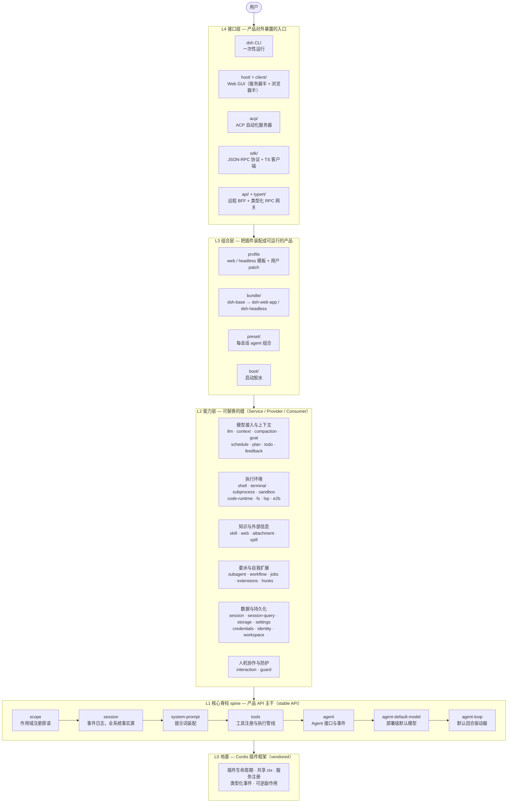

# 贡献者学习路径（七阶段）

**文档性质：本文是一份"索引/排序"文档，不拥有任何事实。** 它只回答两个问题：先读什么、后读什么，以及每一阶段怎样算过关。所有工程事实的唯一归属（one home per fact）是其原文档：根 [AGENTS.md](../AGENTS.md)、[architecture.md](../docs/architecture.zh.md)、[glossary.md](../docs/glossary.zh.md)、[testing.md](../docs/testing.zh.md)、各包 README 与 Agent Notes。本文对事实只给指针，不复制、不复述；任何一处本文与原文档冲突，以原文档为准，并应当修正本文。唯一的结构性例外是阶段 1 的"架构总览"一节：它是既有事实的鸟瞰重组（不新增事实），为"先整体后细节"提供认知框架，其重组误差同样以原文档为准修正。仓库处于 pre-release 姿态（见根 AGENTS.md "Pre-release stance" 节），包名与路径可能整体重排，因此本文的可信度以链接目标为准，而不是以本文自身为准。

**状态：CMR 团队最终共识版 v1（冻结候选）。** 本文档尚未纳入 [doc-budgets 清单](../scripts/doc-budgets.manifest.json)，也未配英文版；若正式入库，需按 [docs/AGENTS.md](../docs/AGENTS.md) 确定所属 tier（本文按 tutorial 分类）、补齐中英配对、登记字数预算。

## 读者与前置

面向首次接触本仓库的贡献者。前置条件：Node（`^22.19 || >=24`）与 pnpm 可用；不要求持有 `DEEPSEEK_API_KEY`——本路径阶段 1–7 的全部过关检验在无 key 环境下均可完成（依据见 [testing.md](../docs/testing.zh.md) 的 keyless 分层）。

七阶段为推荐顺序而非硬性串行：可以在阶段间来回，但阶段 3 的三项前置检查通过之前，不要动手改任何模型可见行为（原因见阶段 3）。

入门第一步（建议先于阶段 1 执行）：完成学习区实验 [experiments/001-log-anchor.zh.md](experiments/001-log-anchor.zh.md)——用一条 keyless 快照日志建立五层架构的实物锚点，约 3 小时；学习区的记录方式见 [method.zh.md](method.zh.md)，进度看板见 [index.zh.md](index.zh.md)。

## 总览

| 阶段 | 主题 | 核心产出 |
|---|---|---|
| 1 | 仓库结构与无 key 启动 | 一页纸五层架构总览；环境就绪；看懂 profile/bundle/patch 层序；五个核心术语 |
| 2 | Cordis 框架 | 能解释"一切皆插件"与"注册即效果" |
| 3 | 核心 spine 与回合流 | 通过 Model-visible⟺logged 三项前置检查 |
| 4 | 能力缝与 scope | 能独立拆解一个完整 seam 的三个角色 |
| 5 | 扩展实践 | 走完一个 cookbook 端到端指南 |
| 6 | 测试策略与 keyless | 能为模型可见变更补 keyless snapshot |
| 7 | 专项深入（按需） | 在所选领域独立定位事实的 home |

## 阶段 1 — 仓库结构与无 key 启动

目标：先建立五层架构的整体认知（一页纸鸟瞰），再建立仓库地图，跑通 keyless 工具链，掌握贯穿全程的五个核心术语。

### 架构总览：一页纸建立整体认知

本节是既有事实的鸟瞰重组（不新增事实），提供"先整体、后细节"的认知框架；每条的权威定义在其事实源，冲突时修本节——整体形态与分层见 [architecture.zh.md](../docs/architecture.zh.md) 与 [packages/README.zh.md](../packages/README.zh.md) 组表，脊柱逐包见 [packages/core/README.zh.md](../packages/core/README.zh.md)，缝的形态见 [glossary.zh.md](../docs/glossary.zh.md) 的 capability-seam 词条。

**dsh 是什么**：基于 Cordis 插件框架的 LLM Agent 运行时骨架，信条 "everything is a plugin"——模型适配器、工具注册表、会话日志、agent 循环本身全是插件，因此每一部分都可从配置替换，没有需要打补丁的特权核心。抓三条主线即可建立整体认知：

1. **静态视角**：一个运行中的 dsh 是一棵按序装配的插件树——组合层决定谁在场。
2. **运行视角**：脊柱驱动回合循环——组装提示词 → 调模型 → 执行工具 → 结果写回会话日志 → 判断是否继续（阶段 3 深入）。
3. **扩展视角**：所有能力都是缝（seam）：Service Definition 声明接口、Service Provider 实现、Consumer 消费（通常是模型可见工具）；换一个 Provider，整个产品跟着变（阶段 4 深入）。

**五层架构图**：



**每层职责与层间关系**：

- **L0 地基 — Cordis 插件框架**：全仓唯一的框架代码（vendored），提供插件模型的三件事——向共享 `ctx` 注册服务、类型化事件、一切注册皆可逆副作用（插件卸载时自动回滚）。"一切皆插件、一切可替换"由它背书。深入在阶段 2。
- **L1 核心脊柱（spine）**：七包构成产品 API 主干，承诺 stable API；包间依赖序即图中链。它定义协议与主干行为，不实现具体能力。注意"主干"不等于物理不可替换——`agent-loop` 本身可换，扩展插件依赖 `agent` 接口而非驱动。深入在阶段 3。
- **L2 能力层 — 可替换的缝**：约三十个包，每个能力是一个完整 seam（三角色）。本层铁律：扩展插件只依赖 Service Definition，从不依赖具体 Provider——因此换一个 Provider，整个产品跟着变（如 fs 与 subprocess 共享执行世界，指向远程沙箱时 Bash/PTY/LSP 一起迁移）。深入在阶段 4。
- **L3 组合层**：把静态的包变成可运行产品。装配序：profile 列出的 bundle 按序应用 → profile `cordis.patch.yml` → home 级 patch → `--patch` 覆盖；每行配置都可被上层整行替换。`dsh-base` 是所有 profile 的第一层（模型适配器、工具、持久化、沙箱与审批、设置、凭据、遥测），`dsh-web-app`/`dsh-headless` 在其上叠加出不同产品形态。
- **L4 接口层**：装配好的插件树经不同入口对外服务：CLI、Web GUI、ACP 自动化、进程外 JSON-RPC SDK。UI 类消费者驱动 `ctx.agents` 并从 `session/event` 渲染，不碰循环内部。
- 横切支撑（不参与运行时分层）：`util/`（零依赖工具）、`test-support/`（测试基础设施）、`examples/`（可运行示例）。

**每层主要模块及职责**：

脊柱七包（ctx key 与排序理由的完整版在 [packages/core/README.zh.md](../packages/core/README.zh.md)，阶段 3 逐包精读）：

| 脊柱包 | 职责 |
|---|---|
| `core/scope` | 被其余各包共享的作用域注册原语（库，无 ctx key） |
| `core/session` | append-only 会话事件日志与内存 store——全系统事实源 |
| `core/system-prompt` | 提示词段落与工具 schema 的装配 |
| `core/tools` | 带守卫的工具注册表与执行管线 |
| `core/agent` | Agent 公共接口、活跃注册表、`agent/*` 事件 |
| `core/agent-default-model` | agent 入口共享的部署级默认模型选择 |
| `core/agent-loop` | 实现该接口的默认回合驱动器 |

能力层按六个职责子域分组（逐包细节以各组 README 为准）：

| 子域 | 包与职责 |
|---|---|
| 模型接入与上下文 | `llm`（`ctx.llm` 消息/流词汇 + 适配器缝 + DeepSeek provider）· `context`（模型可见请求上下文：工作区指令、时间）· `compaction`（上下文压缩）· `goal`（会话内目标持久化）· `schedule`（会话内定时追问）· `plan`（计划协作状态）· `todo`（`todo_write` 工具）· `feedback`（人类反馈） |
| 执行环境 | `shell`（Bash 执行缝 + 本地实现 + 工具）· `terminal`（持久 PTY 会话）· `subprocess`（子进程缝 + 本地进程树）· `sandbox`（进程约束：bwrap/Landlock/Seatbelt）· `code-runtime`（worker 线程代码执行 + PTC mode）· `fs`（文件系统缝 + 文件工具）· `lsp`（语言服务器缝 + `lsp` 工具）· `e2b`（E2B 远程沙箱，POC） |
| 知识与外部信息 | `skill`（技能注册表 + 目录/加载工具）· `web`（搜索/抓取缝与工具）· `attachment`（附件身份与内容寻址存储）· `spill`（工具结果外溢存储） |
| 委派与自我扩展 | `subagent`（子 agent 委派缝与工具）· `workflow`（工作流缝 + worker 线程引擎 + `workflow`/`ralph` 工具）· `jobs`（后台任务 + `job_*` 控制工具）· `extensions`（运行时自检与插件挂载——自我修改）· `hooks`（Claude Code/Codex 钩子桥 + wire 协议库） |
| 数据与持久化 | `session`（持久化缝 + JSONL 后端（0.1.2-alpha.3 起为唯一 first-party 实现，SQLite 后端已移除）、投影、标题、报告）· `session-query`（会话检索：语料、血缘、全文搜索）· `storage`（非会话存储枢纽）· `settings`（用户设置缝 + 文件 provider）· `credentials`（凭据引用缝 + env/.env provider）· `identity`（匿名身份）· `workspace`（工作区实体） |
| 人机协作与防护 | `interaction`（审批/交互缝、权限预设、命令、ask-user 工具）· `guard`（循环卫生守卫 + 工具超时强制） |

组合层与接口层：

| 层 | 模块 | 职责 |
|---|---|---|
| L3 | `bundle/base`（dsh-base） | 所有 profile 的第一层：模型适配器、工具、持久化、沙箱与审批、设置、凭据、遥测 |
| L3 | `bundle/web-app` / `bundle/headless` | 叠加浏览器应用 / 无服务器一次性 runner |
| L3 | `preset` | 从预设 `cordis.yml` 组合每会话 agent |
| L3 | `boot` | 各启动 bin 共享的启动胶水 |
| L4 | `host` + `client` | Web GUI 服务器半（API 网关 + HTTP 路由）与浏览器半 |
| L4 | `acp` / `sdk` | ACP 自动化服务器 / 进程外 JSON-RPC 协议 + TS 客户端 + 服务器插件 |
| L4 | `api` + `typert` | 远程 BFF 装配 + 类型图生成与 RPC 网关 |

**一条消息如何穿过五层**（运行时鸟瞰；逐事件追踪在阶段 3）：

1. L4 入口收到输入，送进 `ctx.agents` 的 inbox。
2. L1 session 将其记为 `user/message`——"模型可见必先落日志"，由运行时不变量断言。
3. `agent-loop` 认领输入，`system-prompt` 装配各插件注册的提示词段与工具 schema，`agent/pre-step` 瀑布可改写或拒绝。
4. `ctx.llm` 缝把请求交给 L2 在场的 provider，流式响应逐块记为 `assistant/chunk`。
5. 工具调用走 L1 tools 三层 waterfall 守卫管线，落到 L2 具体 seam（fs / shell / web / subagent…）执行，结果记为 `tool/result`；若仍欠工具请求或有新输入到达则进入下一个 step，否则 `turn/end`。
6. 全程 L3 决定这棵树上"谁在场"——换 profile 即换能力集，spine 与缝的代码不动分毫。

本节之后按精读材料逐层下钻；三张细节图——依赖全景 [module-graph.zh.md](../docs/module-graph.zh.md)、缝全景 [capability-seams.zh.md](../docs/capability-seams.zh.md)、回合时序 [agent-lifecycle.zh.md](../docs/agent-lifecycle.zh.md)——分别在阶段 3、4 使用，现在不必啃。

精读材料（按序）：

1. [README.zh.md](../README.zh.md) — 产品一句话定位。
2. 根 [AGENTS.md](../AGENTS.md) — 只精读三节：Repository layout、Commands、Secrets/.env。这是每个会话都需要在场的常备规则，其余各节后续阶段按需回读。
3. [apps/cli/README.zh.md](../apps/cli/README.zh.md) — `dsh` 启动器的入口模式与 profile/bundle/patch 组合层序；精确的层优先级与旗标语义在 [CLI 行为参考](../apps/cli/reference/README.zh.md)。
4. [development.zh.md](../docs/development.zh.md) — 贡献者日常流程与 TypeScript 工程布局。
5. [glossary.zh.md](../docs/glossary.zh.md) — **必读**。重点读三节：capability-seam、agent-scope、loop hierarchy；goal 与 Ralph 两节可先扫过，阶段 7 按需回读。

动手任务：

1. `pnpm install`，然后 `pnpm run typecheck` 与 `pnpm run test`（单测层是 keyless 的）。
2. `pnpm dsh --profile web --dump-config` — 不启动应用、打印本机实际组合出的配置树，用来肉眼验证你在 CLI README 里读到的层序。

过关检验：见完成标志表"阶段 1"行。

## 阶段 2 — Cordis 框架

目标：理解 dsh 之下的插件框架——服务、类型化事件、可逆效果如何挂到共享上下文。

精读材料（按序）：

1. [cordis-primer.zh.md](../docs/cordis-primer.zh.md) — 精读，包括 waterfall 必须调用 `next()` 的语义。
2. [Cordis 教程](../docs/cordis-tutorial/index.zh.md) 01–07 — 按序做完，尤其 07 "into the harness" 把教程与本仓库接起来。
3. [cordis-api/context.zh.md](../docs/cordis-api/context.zh.md) — 工具书性质，先读开头定位方式即可，不必通读。

动手任务：把教程 01 的第一个插件在本机跑起来；对照根 AGENTS.md "Registrations are effects" 一行，确认自己能指出哪一行代码产生了哪个可逆注册。

过关检验：见完成标志表"阶段 2"行。

## 阶段 3 — 核心 spine 与回合流

目标：读通产品 API 主干（core 组七包）与一次 turn 的完整生命周期，并通过进入深水区前的三项前置检查。

**core 包依赖序**（事实源：[packages/core/README.zh.md](../packages/core/README.zh.md) 的包表与依赖说明；建议按此序逐包读 README）：

```
scope → session → system-prompt → tools → agent → agent-default-model → agent-loop
```

排序理由（一句话导航，不替代原文）：`scope` 是被其余各包共享的注册原语；`session` 的事件日志是全系统事实源；`system-prompt` 与 `tools` 从日志与注册表组装模型请求的输入；`agent` 拥有公共接口与事件词汇，`agent-default-model` 是其入口共享的部署级默认模型选择；`agent-loop` 只是该接口的默认具体驱动，扩展插件依赖接口而非驱动。

精读材料（按序）：

1. [architecture.zh.md](../docs/architecture.zh.md) — 全文精读；这是改 `packages/` 之前的必读文档（根 AGENTS.md 首段要求）。
2. [subsystems/core.zh.md](../docs/subsystems/core.zh.md) — Agent 句柄、投递/拦截契约、逐包回路图。
3. [agent-lifecycle.zh.md](../docs/agent-lifecycle.zh.md) 与 [tool-execution-pipeline.zh.md](../docs/tool-execution-pipeline.zh.md) — 时序图与工具管道。
4. core 组七包 README（按上述依赖序）。

动手任务：在一段 replay 的会话日志（或一次真实 turn 的日志）里，对照 architecture.md 的 Turn flow 文本图，逐事件追踪 `turn/start` 到 `turn/end`，标出哪些是持久会话事件、哪些是存活扩展点。

**三项前置检查（Model-visible⟺logged）**——出自根 AGENTS.md 同名约定与 [architecture.zh.md](../docs/architecture.zh.md) "Session log" 一节。三项全部通过前，不要改动任何模型可见行为；改动模型可见面而不满足第 3 项，是本仓库明确禁止并设有运行时不变量断言的错误类别：

1. **事实源**：能凭自己话说出"会话日志是模型所见上下文的事实源，`deriveMessages()` 从日志投影模型历史，原始 `assistant/chunk` 事件保重放与 UI 保真"。
2. **可重建**：能凭自己话说出"任何到达模型请求的内容必须可从会话日志重建；这一点由运行时不变量断言，不是口头约定"。
3. **新输入**：能凭自己话说出"新增一个模型可见输入，必须新增一个会话事件：扩展 `SessionEventMap` 并从日志渲染"，并能在 `SessionEventMap` 里指出最近一次这样做的先例。

过关检验：见完成标志表"阶段 3"行。

## 阶段 4 — 能力缝与 scope

目标：掌握本仓库最主要的结构模式——完整的能力缝（Service Definition / Service Provider / Consumer 三角色）与两级扁平的 scope 注册模型。

精读材料（按序）：

1. [capability-seams.zh.md](../docs/capability-seams.zh.md) — 能力缝全景图。
2. [glossary.zh.md](../docs/glossary.zh.md) 的 capability-seam 与 agent-scope 两节二次精读 — 第一遍记术语，这一遍记结构：seam 是完整能力而非任一角色；scope 两级扁平、不向下继承、子树行为用 lineage 数据表达。
3. [subsystems/scope.zh.md](../docs/subsystems/scope.zh.md) — scope 原语参考页。
4. [subsystems/shell.zh.md](../docs/subsystems/shell.zh.md) — 样板缝：以 shell 家族（`dsh-shell` 定义、`dsh-bash-local`/`dsh-bash-sandbox` 提供、`dsh-tool-bash` 消费）对照三角色。

> LLM 缝在 rc.8 新增了图片（image）维度：`llm` 内容块新增 `image` 类型，视觉模型经 `inputModalities: [text, image]` 声明。rc.2 起图片改走 Files API（`type:'file'` + `file_id`），失败才回退内联 base64；上限由 `RequestImageOffloadPolicy`（`maxRequestFilesBytes` / `maxImagesPerRequest` / quantum 步进）管理。阶段 4 拆解 LLM 缝时，可把「文本之外的第二输入模态」当作 Provider 可替换性的一个对照素材。

动手任务：在你阶段 1 打印的 `--dump-config` 组合树里，任选一条能力行，指出它背后的三个角色各由哪个包承担；再找一个"一个包兼任多角色"的反例并解释何时允许（线索在 glossary seam 词条与 [packages/README.zh.md](../packages/README.zh.md) Dependencies 一节）。

过关检验：见完成标志表"阶段 4"行。

## 阶段 5 — 扩展实践

目标：把前四阶段的读变成一次端到端的小改动，走完"新增行为挂在已文档化扩展点上"的全流程。

精读材料：

1. [cookbook/extension-cookbook.zh.md](../docs/cookbook/extension-cookbook.zh.md) — 特征到能力的映射总表。
2. 按你的目标二选一精读：[cookbook/adding-a-tool.zh.md](../docs/cookbook/adding-a-tool.zh.md) 或 [cookbook/adding-a-package.zh.md](../docs/cookbook/adding-a-package.zh.md)；做前端节点或模型适配器再回读 [adding-a-conversation-node.zh.md](../docs/cookbook/adding-a-conversation-node.zh.md) / [adding-an-llm-adapter.zh.md](../docs/cookbook/adding-an-llm-adapter.zh.md)。

动手任务：完成所选指南的全部编号 verify 步骤；改动若触及模型或产品用户可见行为，同 PR 补一条 keyless snapshot（要求的事实源在 [testing.zh.md](../docs/testing.zh.md) "When a snapshot test is required" 一节，本阶段只需照做，阶段 6 讲为什么）。

过关检验：见完成标志表"阶段 5"行。

## 阶段 6 — 测试策略与 keyless

目标：掌握本仓库的测试分层与 keyless 策略，理解"绿灯单测、坏产品"这一类别为何由 snapshot 层兜底。

精读材料：

1. [testing.zh.md](../docs/testing.zh.md) — 全文精读，这是 key 策略的唯一事实源（根 AGENTS.md 明确 "testing.md owns key policy"）。
2. [postmortem/0001](../docs/postmortem/0001-acp-default-export-drops-inject.zh.md) — snapshot 层存在理由的实例。
3. [examples/AGENTS.md](../examples/AGENTS.md) — 每个示例自带 keyless 与 with-key 冒烟。

keyless 策略要点（每条的权威定义都在上面的链接里，此处仅导航）：

- **无 key 不阻塞**：真实 API e2e 各套件在无对应 key 时自跳过，keyless CI 与无 key 贡献者保持可用；自跳过是设计而非成本信号。
- **keyless 回放层**：`pnpm run test:snapshot` 以 keyless 回放比对期望输出，覆盖传输契约与呈现；重录期望（`test:snapshot:record`）才需要 key。
- **可见变更必配 snapshot**：每个非平凡的模型/产品用户可见行为变更，必须同 PR 通过真实可运行示例补 keyless snapshot；包测试、e2e 断言、mock 夹具不能替代组装后的应用 transcript。
- **有 key 不配给**：真实模型行为只能由 with-key 运行证明；最高价值的是"启动真实示例、发一条提示、检查世界"的冒烟。

动手任务：`pnpm run test:snapshot` 跑通；本地实验性地改坏一处期望输出观察红灯（不要提交），体会该层捕捉什么。

过关检验：见完成标志表"阶段 6"行。

## 阶段 7 — 专项深入（按需）

目标：按工作需要自选一至两个领域深入。本阶段不设统一过关线，唯一要求是能在所选领域独立定位"事实的 home 在哪个文档"。

可选方向（均为指针）：

- 事件全景：[event-producer-consumer.zh.md](../docs/event-producer-consumer.zh.md)（每个事件的生产者与消费者）。
- 持久化：[subsystems/persistence.zh.md](../docs/subsystems/persistence.zh.md) 与 [persistence-catalog.zh.md](../docs/persistence-catalog.zh.md)。
- 配置面：[config-catalog.zh.md](../docs/config-catalog.zh.md)（生成源，英文版权威）。
- 模块依赖：[module-graph.zh.md](../docs/module-graph.zh.md)（生成源，CI 新鲜度门禁）。
- Web 双半：[subsystems/web-server.zh.md](../docs/subsystems/web-server.zh.md)（宿主半）与 [subsystems/client-modules.zh.md](../docs/subsystems/client-modules.zh.md)（浏览器半）。
- 出进程面：`packages/sdk`、`packages/acp` 各组 README，以及 [python/README.zh.md](../python/README.zh.md)。
- 自我修改与扩展运行时：[subsystems/extensions.zh.md](../docs/subsystems/extensions.zh.md)。
- 多 agent 协作：[packages/experimental/agent-team](../packages/experimental/agent-team/README.zh.md) 与 `tool-agent-team`（实验能力，rc.8 引入，新增 `team/*` 会话事件）。

## 完成标志表

| 阶段 | 完成标志（可逐条勾选） |
|---|---|
| 1 | ① `pnpm install` / `typecheck` / `test` 在本机通过；② 能不看资料说出组合层序：bundle（按 profile 列序）→ profile `cordis.patch.yml` → home 级 patch → `--patch` 覆盖；③ `dsh --profile web --dump-config` 成功打印组合树——注意该旗标是 boot-free（不启动应用），但必须与 `--profile` 同用，单独运行会因缺少必需的 `--profile` 报错、退出码 1；④ 能用自己的话复述 glossary 的 seam / scope / turn / step / round 五个核心术语（不要求 glossary 全表背诵，其余词条按需查）；⑤ 能凭记忆复述五层骨架（Cordis 地基 → spine → 能力缝 → 组合层 → 接口层）并对每层说出一句职责 |
| 2 | ① 能指出一段插件代码里 `ctx.effect()` / `ctx.on()` 各自产生的可逆注册；② 能解释 waterfall 监听器为何必须调用 `next()`，以及不调用的后果；③ Cordis 教程 01–07 的练习全部跑通 |
| 3 | ① 通过三项前置检查（事实源 / 可重建 / 新输入，见阶段 3 原文）；② 能按依赖序 scope → session → system-prompt → tools → agent → agent-default-model → agent-loop 说出每包职责与 ctx key（scope 无 key，说明原因）；③ 能对照 Turn flow 文本图，把一次真实或 replay 的 turn 从 `turn/start` 追到 `turn/end`，并区分持久事件与存活扩展点 |
| 4 | ① 能以 shell 家族为例说出完整 seam 的三个角色及各自包名；② 能复述 scope 的两级扁平模型，并解释 shadowing 与 restriction 的作用方向（scoped 注册在全局过滤之后合并）；③ 能举出一个包兼任多角色的合法案例 |
| 5 | ① 所选 cookbook 指南的全部 verify 步骤通过；② 改动遵守"挂在已文档化扩展点"而非改 loop；③ 若触及模型/用户可见行为，同 PR 的 keyless snapshot 已补 |
| 6 | ① 能说出五层测试 tier（unit / coverage / e2e / snapshot / web snapshot）各自把关什么；② 能复述 keyless 策略四要点（无 key 不阻塞 / keyless 回放层 / 可见变更必配 snapshot / 有 key 不配给）；③ `pnpm run test:snapshot` 本机跑通 |
| 7 | 在自选领域能：(a) 说出该领域事实的 home 文档；(b) 解释该领域当前行为而不需要本文 |

## 风险提示

- **索引会漂移，事实不会**：本仓库 pre-release 姿态下重命名与重打包随时发生。本文所有内容以链接目标的当前内容为准；发现不一致时修正本文，绝不反向修改原文档来迁就本文。
- **生成源不可手改**：config-catalog、module-graph、persistence-catalog、tool-catalog 等为生成文档，英文版是权威源，中文版经配对流程更新；直接手改中文版无效。
- **不背 glossary 全表**：完成标志只考核五个核心术语；goal/Ralph 等领域词汇在进入对应领域时再查。
- **深水区前置**：触碰生命周期、并发、子进程、拆除类代码前，先读 [defensive-patterns.zh.md](../docs/defensive-patterns.zh.md)（根 AGENTS.md 强制要求）。
- **loop 红线**：新行为挂在已文档化扩展点上；直接改 `agent-loop` 必须同步更新 [architecture.zh.md](../docs/architecture.zh.md)（根 AGENTS.md "Plugins, not loop changes"）。
- **三项检查是闸门不是建议**：阶段 3 的三项前置检查未全部通过就改模型可见面，等于在生产违规类别上工作——该类别有运行时不变量断言，会以失败形式暴露。
- **无 key 的能力边界**：无 key 环境验证不了真实模型行为，此类结论只能引用 CI 的 with-key 结果；本地"全绿"不覆盖该面。
- **本文自身的入库状态**：尚未登记 doc-budgets、未配英文版；在正式入库前，它是 CMR 团队冻结的交付物，不是仓库门禁体系内文档。

## 本文档的维护

发现指针失效、层序变化或完成标志与原文档冲突时：以原文档为准，修本文的对应行；包结构大改（重命名、重分组）时逐链接核对一遍。本文不新增事实——任何想在本文展开的工程细节，都应写进它的 home，再由本文加一行指针；阶段 1 "架构总览"一节的鸟瞰重组是文档性质声明中的例外，它只重组既有事实，不改变此规则。
