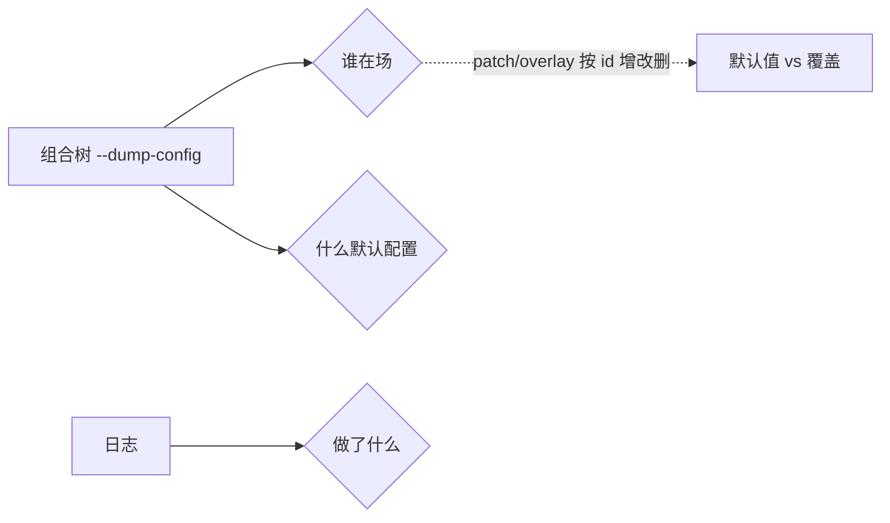
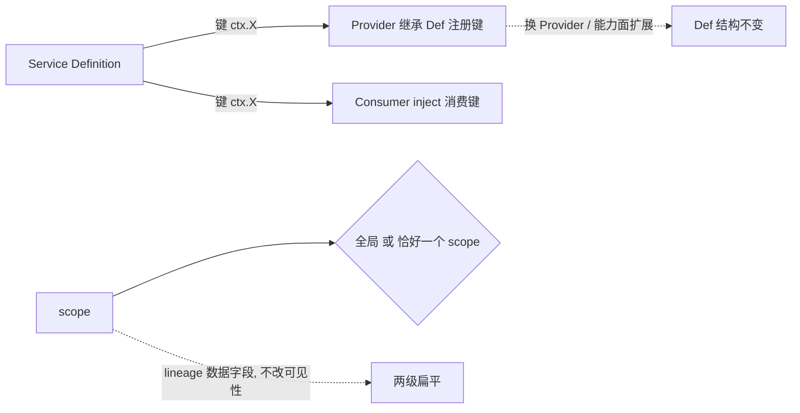
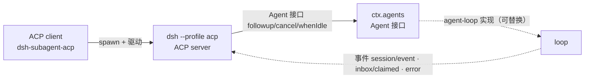

# 认知地图

状态：草稿（2026-08-17，完成实验 001 日志锚点后首次落笔）｜已对照 rc.8（2026-08-21 版本对齐，补 LLM 缝推理回传/图片、横切机制取消收尾两处增量，断层新增 agent-loop 取消收尾待补）｜已对照 rc.2（2026-08-22 版本对齐，LLM 缝图片维度重构：Files API 为主、上限策略化、文本模型投影，见「rc.2 增量」；core 七包与 Agent Teams 源码无变化，其余结论仍成立）｜阶段 4 快照（2026-08-23，补「能力缝结构」：三角色对齐机制、scope 两级扁平、换 Provider 与能力面扩展两案例、seam 三篇笔记分工）｜已对照 0.1.2-alpha.2（2026-09-01 版本对齐，section order 集中化、工具呈现模式 code→ptc、request/header 加 series、session projection 进 spine，见下方「0.1.2-alpha.2 增量」；core 七包结构、SESSION_FORMAT_VERSION=0、五层架构主干结论仍成立）｜已对照 0.1.2-alpha.3 + 0.1.2-alpha.4（2026-09-02 版本对齐，JSONL-only 会话持久化、turnOutline 投影单元、seq/log offset 类型分离、base 默认 web_fetch、subagent steer 统一投递、PTC preset 去 workflow，见下方「0.1.2-alpha.3/4 增量」；core 七包结构、五层架构主干、日志三层模型、「模型可见 ⟺ logged」结论仍成立）

## 提纲（已知 / 未知 / 猜测）

- **组合层**：已知「谁在场」由 `--dump-config` 回答；profile/bundle 含义、五层层序（bundle×2 → profile patch → home patch → --patch）、patch 按 id 整行替换/insert、bundle 自挂载；见 [notes/architecture/composition-layer.zh.md](notes/architecture/composition-layer.zh.md)。
- **spine（agent / agent-loop）**：已知 `AgentRegistry`（登记）与 `AgentFactory`（创建）接口/实现分离、`loop 可替换`、五个 inject 服务（`agents`/`sessions`/`llm`/`tools`/`systemPrompt`）的提供者与职责；见 [notes/architecture/core-spine.zh.md](notes/architecture/core-spine.zh.md)。
- **工具管线**：已知 `tool-*` 插件注册工具 → `tools` 聚合 → 投影进 request。
- **能力缝（seam）**：已知三角色（Def/Provider/Consumer）、为何含 Consumer、可替换四种机制（机制 1/2/3 写插件、机制 4 改配置；「改代码」= 写自定义插件而非改既有包源码）、行为不匹配的两种安全哲学、三角色构成与对齐机制（`inject` 声明 + `super(ctx,key)` 注册、request/spec 拆分、换 Provider 与能力面扩展两案例）、scope 两级扁平 + shadowing/restriction 作用方向、lineage 是数据不是结构；三篇笔记分工见下方「详解」。见 [notes/architecture/seam-and-replaceability.zh.md](notes/architecture/seam-and-replaceability.zh.md)、[notes/architecture/seam-structure.zh.md](notes/architecture/seam-structure.zh.md)、[notes/architecture/capability-seam-catalog.zh.md](notes/architecture/capability-seam-catalog.zh.md)。
- **LLM 缝**：已知流式 chunk（block-start→delta→block-end）与聚合 message 的关系；未知真实 provider 的流式实现。
- **提示词装配**：已知「先 logged 后投影、投影会裁剪会重排」；未知投影实现代码（`deriveMessages()`/`assembleContextFor`）。
- **横切机制**：已知「模型可见⟺logged」（三套投影：surface / request-header 重建模型可见内容，sessionProjections 折叠客户端派生状态）、turn/step 继续条件、append-only + seq 引用 + `sourceEventSeqs` 三板斧。
- **接口层（ACP）**：已知 ACP 是「仅面向自动化的协议传输层」（非 UI）、一次 prompt 的准入/结算/取消两段式生命周期（分界线 `messageQueued`）、与 agent-loop 无直接依赖（inject 只有 `agents`/`llm`/`sessionPersistence`/`sessions`，靠三个事件反向观察 loop）、被 `dsh-subagent-acp` 作为客户端 spawn 驱动（self-nesting 闭环）；见 [notes/modules/acp.zh.md](notes/modules/acp.zh.md)。

## 详解

### 组合层（谁在场）

`--dump-config` 输出的是「组合树」：每个插件一行（id + name + config），行前 `# == ...` 注释标来源层（`dsh-base` / `patched by dsh-headless` / `dsh-headless`）。它只回答「谁在场 + 什么默认配置」，不回答「运行时发生了什么」。

**组合树不是「文档」，是「命令输出」**：它是 `pnpm dsh --profile X --dump-config` 的实时输出（一段 YAML），不是写死在某个 `.md` 里的内容。它的「规则」（profile/bundle/patch 层序、`--dump-config` 语义）记录在 [architecture.zh.md](../../docs/architecture.zh.md)「组合层」一节 + [cordis-primer.zh.md](../../docs/cordis-primer.zh.md) + [apps/cli/README.zh.md](../../apps/cli/README.zh.md)；它的「具体内容」（某个 profile 实际装配了哪些插件）每次都现场生成，随机器环境/patch/profile 而变，不存文档。注意区分：`session.expected.jsonl` 是「日志快照」，**不是**组合树。

默认值与覆盖是这一层的常态：模型默认 `deepseek-v4-flash`、可 patch 成 `cli-mock`；标题有兜底（`session-title`）+ 可叠加 LLM（`session-title-llm`）；agent 默认 `[]`（全按需）、可预置声明式 agent。

### 能力缝（seam）结构

seam 是 L2「能力层」的组织单位：Service Definition + Provider + Consumer 三角色合成的「完整可替换能力」。阶段 4 补全了「缝的通用结构」，与既有「缝如何替换」形成「结构 vs 替换」两个正交维度。

**三篇笔记分工**（2026-08-23 定稿）：

| 笔记 | 回答的问题 |
|---|---|
| [capability-seam-catalog.zh.md](notes/architecture/capability-seam-catalog.zh.md) | 有哪些缝（60 键目录清点 + 28 seam 三角色表 + mode 三值判据「替换发生在哪一层」） |
| [seam-structure.zh.md](notes/architecture/seam-structure.zh.md) | 缝长什么样（三角色构成 + 对齐 + 数据流 + 换 Provider / 能力面扩展） |
| [seam-and-replaceability.zh.md](notes/architecture/seam-and-replaceability.zh.md) | 缝怎么替换（可替换四机制 + 行为匹配两哲学） |

**三角色对齐机制**：对应关系不在 `--dump-config` 里（dump 只列「谁在场」，不画依赖箭头），而由两层机制表达，靠「服务键」对齐——Consumer 通过 `inject: ['shell']` 声明消费键；Provider 继承 Def 抽象类时 `super(ctx, 'shell')` 注册键。两者互不知晓对方具体包名，只认「键」这个中间层。

**scope 两级扁平**：一项贡献要么全局、要么「恰好归属一个 scope key」，无作用域链、不向下继承。shadowing（子遮蔽父同名项，向下继承、近者胜出）与 restriction（先过滤全局集合、再合并 scoped 注册，scoped 覆盖/收窄全局）都作用在「具名工具 `ToolDefinition`」上。lineage（`parentSession`/`delegationDepth`/`origin` + 0.1.2-alpha.4 起 `isSeeded`/`inheritedEventCount` 取代旧 `seedLength`）是「数据字段」不是「结构」——只记录父子事实，从不改变可见性。

**换 Provider 与能力面扩展是同一原则的两面**：换 Provider（bash-local → bash-sandbox）和能力面扩展（LLM 缝加图片 `inputModalities: [text, image]`）都保持 Def 结构骨架不动——前者变的是 Provider 实现细节，后者变的是「Provider 声明 + Def 通用数据类型」，Def 的键/方法/生命周期都不变。深层原则：Def 提供「通用载体 + 通用门控」，Provider 用「声明」注入差异化能力。

### packages/core 三层架构（产品主干）

`packages/core` 是「产品 API 主干」，7 个包分三层：地基库（`scope`）→ 注册表（`session`/`tools`/`system-prompt`）→ 执行者（`agent`/`agent-default-model`/`agent-loop`）。Cordis 是 vendored 进 `vendor/` 的底层框架，core 每个包都是用 Cordis 写的插件。

详细知识（含 spine 的接口/实现分离、两个 agents 辨析）见 [notes/architecture/core-spine.zh.md](notes/architecture/core-spine.zh.md)。

### 工具管线

`tool-*` 插件各自注册一个工具，`tools` 插件聚合为清单，投影进 request 的 `header.tools`。日志只记「bash 被调用了」（`tool/call`/`tool/result`），「bash 是谁注册的」不在日志里、在组合树。这是「日志记行为、组合树记候选行为者」的体现——真正的行为者是「候选 + 行为」的匹配结果。

### LLM 缝（流式）

模型流式输出 = 一个内容块（block）拆成多个事件块（chunk）：`block-start → delta → block-end`，`usage`/`finish` 是附属报告。chunk 保流式保真，`assistant/message` 是聚合投影，`sourceEventSeqs` 钉住「聚合体 → 原始碎片」。

**rc.8 两处增量**（2026-08-21 对照 rc.7→rc.8 diff 记录）：
- **推理内容回传规则**：DeepSeek 适配器的 `reasoning_content` 改为**所有轮次原文回传**（不论是否调用工具）；rc.7 仅工具调用轮次回传、其余丢弃以省 token。
- **图片（image）内容**：`llm` 内容块新增 `image` 类型；视觉模型经 `inputModalities: [text, image]` 声明。（rc.2 已更新，见下方「rc.2 增量」。）

**rc.2 增量**（2026-08-22 对照 rc.8→rc.2 diff 记录；图片管理策略重构，来自 worktree/image-management-strategy）：
- **图片改走 Files API**：视觉模型**通常通过 Files API 引用**收到图片（`type:'file'` + `file_id`，旁带稳定附件句柄 + 请求图片尺寸），Files 解析失败才回退内联 base64 data URL。`ImageBlock` 只携带持久 `ImageAttachmentRef`，提供方字节与请求尺寸之后才解析。
- **上限拆成一整套策略字段**：rc.8 的单一 `maxRequestImageBytes`（20 MiB）被 `offloadRequestImagesWithPolicy`（`RequestImageOffloadPolicy`）取代，拆为 `maxRequestFilesBytes`（128 MiB）、`maxInlineRequestImageBytes`（20 MiB 回退水位）、`maxImagesPerRequest`（600）、`imageOffloadByteQuantum`（64 MiB 步进）、`inlineImageOffloadByteQuantum`（10 MiB）、`imageOffloadCountQuantum`（20 张步进），以及 `filesApiTimeoutMs`、`fileExpiresAfterSeconds`、`fileRefreshMarginSeconds`、`fileQuotaCleanupBatch` 等 Files 生命周期字段。
- **文本模型图片投影**：模型 `inputModalities` 不含 `image` 但消息含图时，`LlmRuntime` 用 `projectImagesForTextModel` 把图投影为文本占位（`textOnlyImageText`：`image omitted because this model accepts text only`）。

**0.1.2-alpha.2 增量**（2026-09-01 对照 rc.2→0.1.2-alpha.2 diff 记录）：
- **系统提示词 section order 集中化**：`system-prompt` 把约定俗成的 order 区间（`-100`=身份、`0`=persona、`100–199`=工具引导）改为集中分配的 `SECTION_ORDERS` 常量表（`HARNESS_IDENTITY:-1000`、`DEPLOYMENT_PERSONA:0`、工具引导带 `1000+`、`TOOLS_SDK:5000`、`STRUCTURED_OUTPUT:9900` 等），同 order 按 code-unit 名称排序。
- **工具呈现模式 `code` → `ptc`**：`ToolPresentationMode` 从 `'native' | 'code' | 'both'` 改为 `'native' | 'ptc' | 'both'`；`Code Mode` 术语统一改为 `PTC mode`，`CodeDispatchLog`→`PtcDispatchLog`、`tools/code-dispatch-log`→`tools/ptc-dispatch-log`。
- **`request/header` 新增 series**：`reason` 从 `'initial' | 'resume' | 'change'` 扩为 4 值（+`'series'`），新增 `startsSeries?: true` 字段——changed header 也开启一段独立的 model-message series。
- **session projection 进 spine**：`agent-loop` 新增 `ctx.sessionProjections.register(turnBoundaryProjectionDefinition)`，`core/agent` 新增 `src/projection.ts`；`session-projection` 从 L2 能力层成为 L1 spine 的直接依赖（「host state reads → projections」迁移）。详见 [notes/mechanisms/session-projection.zh.md](notes/mechanisms/session-projection.zh.md)。
- **`textOnlyImageText` 占位文本带 digest**：文本模型图片投影的占位从固定文案改为带 attachment digest（`…; attachment sha256:${digest}`）。

**0.1.2-alpha.3 / 0.1.2-alpha.4 增量**（2026-09-02 对照 alpha.2→alpha.4 diff 记录）：
- **会话持久化只留 JSONL**（alpha.3）：`session-persistence-sqlite` 包整体删除，`session-persistence-jsonl` 成为 `ctx.sessionPersistence` 唯一 first-party 实现；`session-query-sqlite`（FTS5 检索）与 `storage-sqlite`（通用 domain-KV）保留——它们是**可丢弃的派生索引**，不是另一种权威 store。旧 SQLite 数据库不迁移，需要内容者先经仍含该 provider 的 build 导出。权威记录见 `jsonl-only-session-persistence` Agent Note（2026-08-30）。
- **`turnOutline` 投影单元新增**（alpha.3）：新包 `session-turn-outline` 在 `sessionProjections` 注册第二个单元（host-only `turnBoundary` 之后），折叠全日志轮次大纲（`turn/start` seq + 有界提示词/回复预览），服务聊天轮次导航的「整会话按轮跳转」。详见 [notes/mechanisms/session-projection.zh.md](notes/mechanisms/session-projection.zh.md)。
- **事件 seq 与 log offset 类型分离**（alpha.4）：`SessionSeq`（一条已存在事件）vs `SessionLogOffset`（日志间隙/前缀长度/读取切点）两个 brand 强制区分事件身份与间隙坐标；`SessionHeader.seedLength` 数值坐标移除 → `isSeeded: boolean` + 带正文 observation 的 `inheritedEventCount`。磁盘 v0 字节兼容、wire 不变、**行为不变**——是「类型卫生」加固，不推翻既有三层模型。权威记录见 `session-sequence-and-log-offset-brands` Agent Note（2026-08-31）。详见 [notes/mechanisms/log.zh.md](notes/mechanisms/log.zh.md)。
- **base 默认暴露 web_fetch**（alpha.4）：`bundle/base` 的 `cordis.patch.yml` 默认挂载 `tool-web`（`fetch: true` + 60s 搜索超时），headless / SDK / ACP / base-only profile 均继承 `web_search` + `web_fetch`（`sdk-minimal` 不用 base 除外）；web-app 禁用该 base 项、按 agent preset 组装同对工具。效果：基于 base 的模型请求默认暴露抓取 schema 与 prompt 指引，快照 header 同步变化。
- **subagent steer 统一 adjacent agent 投递**（alpha.4）：steer 到同进程 adjacent agent 的投递路径统一，跟随消息的图片可靠送达（此前部分路径丢图）。能力面行为变化，spine/seam 结构结论不变。
- **PTC mode 移除 workflow**（alpha.4）：preset 的 PTC 组合不再含 workflow 工具。

### 提示词装配（投影）

「模型可见 ⟺ logged」：进模型的内容必先落日志，所以「发送 = 投影」——不需要专门 send 事件，因为发送的内容就是已 logged 的行。投影会**裁剪**（主请求装 system+历史+工具，起标题请求只装用户消息）也会**重排**（日志顺序=发生先后，请求顺序=system 在前历史在后）。`role` 与 `source.kind` 分离：前者标记「去路身份」，后者标记「来源身份」。

### 横切机制（四条不变量）

1. **模型可见 ⟺ logged**：任何进模型的东西都能从日志追溯；`role`（去路）/`source.kind`（来源）分离共同服务此信条。「投影」共三套——surface / request-header 重建模型可见内容，sessionProjections 折叠客户端可见派生状态（见 [notes/mechanisms/session-projection.zh.md](notes/mechanisms/session-projection.zh.md)）。
2. **turn/step 继续条件**：`finish.reason=tool-calls` → 工具跑、结果喂回、开新 step；`stop` → turn 结束。一个 turn = 若干 step。
3. **日志三板斧**：`surfaceOp:append`（只增不改）、seq 号引用（指回不复制）、`sourceEventSeqs`（聚合体→原始碎片）。
4. **日志 + 组合树双视角**：日志（`--dump-config` 输出是「组合树」，不是 jsonl）记「行为」，组合树记「候选行为者」；真正的行为者 = 候选 + 行为的匹配结果，组合树不直接点名。插件「在场」≠「在日志里留名」（机制 vs 行为）。
5. **取消流的收尾（rc.8 新增）**：流式输出被取消时，若已送达非空文本/推理内容，`agent-loop` 补一个带 `interrupted: true` 的 `assistant/message` 锚点（`session` 事件新增该可选字段），把已渲染前缀放进派生消息历史——让下一次请求包含用户已看到的内容；未分派的工具调用被省略。这是「模型可见 ⟺ logged」在取消路径上的延伸。

### 接口层（ACP）

ACP（`packages/acp/acp`）是 L4 接口层的一员，与 CLI/Web GUI/JSON-RPC SDK 并列。它的核心定位是「仅面向自动化的协议传输层」：把 `ctx.agents` 暴露成标准 ACP v1 stdio 服务器，只发「已提交语义事实」（消息/thought/工具生命周期/配置/用量），不发 DSH 私有呈现数据——它曾是编辑器桥接层，2026-07-23 决策精简成现在的自动化形态。

一次 prompt 走「准入 → 结算」两段：准入（`followup()` 之前）是同步校验（快照路由、校验 Agent 身份、翻译内容、图片落盘、入队），失败则消息不进 inbox；结算（`followup()` 之后）是事件驱动的异步裁决（等 agent 空闲 + 更新排空，按优先级返回 `stopReason`）。取消也按同一条分界线分两段——分界线始终是 `InflightPrompt.messageQueued` 一个字段。

它与 agent-loop **无直接依赖**：inject 只有 `agents`/`llm`/`sessionPersistence`/`sessions`，通过 `followup`/`cancel`/`whenIdle` 驱动、通过 `session/event`/`agent/inbox/claimed`/`agent/error` 三个事件反向观察 loop——是「loop 可替换」的又一实例。反过来，它被 `dsh-subagent-acp` 作为客户端 spawn 驱动，形成「agent 委派 agent」的自我嵌套闭环。

详见 [notes/modules/acp.zh.md](notes/modules/acp.zh.md)。

## 已知的断层（下次要补）

- patch 的「insert 新条目后、后续 patch 能否再对 inserted 条目 patch」这个边界语义（`applyEntryPatches` 的 inserted-row 索引修复）未读，需读 Cordis include 源码。
- `agent-loop` 取消收尾的实现（`BlockAssembler.interruptedBlocks()` + `agent.ts` 的 catch 分支，rc.8 新增）未读，只知道「补 `interrupted: true` 锚点」的行为；精读 agent-loop 时补。
- `Session.ownEvents()` / `isOwnSeq()` 及持久化 adapter 的 number→brand 验证点（seq/offset 分离的落地细节）未精读——alpha.4 类型卫生的具体接线。
- `turnOutline` 单元与 `session-controller` 的 `loadThrough` 分页、客户端 turn rail 的「已加载窗口 vs 全日志大纲」分工未读（0.1.2-alpha.3/4 新增 UI 能力面）。
