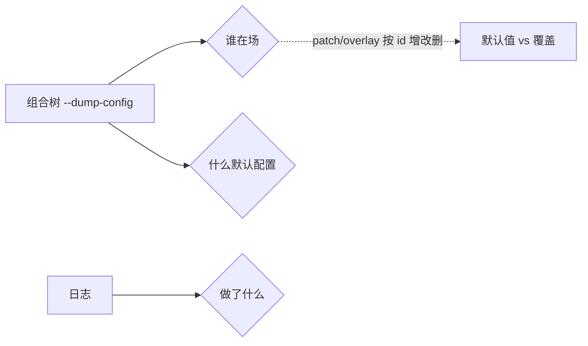

# 认知地图

状态：草稿（2026-08-17，完成实验 001 日志锚点后首次落笔）｜已对照 rc.8（2026-08-21 版本对齐，补 LLM 缝推理回传/图片、横切机制取消收尾两处增量，断层新增 agent-loop 取消收尾待补）｜已对照 rc.2（2026-08-22 版本对齐，LLM 缝图片维度重构：Files API 为主、上限策略化、文本模型投影，见「rc.2 增量」；core 七包与 Agent Teams 源码无变化，其余结论仍成立）

## 提纲（已知 / 未知 / 猜测）

- **组合层**：已知「谁在场」由 `--dump-config` 回答；profile/bundle 含义、五层层序（bundle×2 → profile patch → home patch → --patch）、patch 按 id 整行替换/insert、bundle 自挂载；见 [notes/architecture/composition-layer.zh.md](notes/architecture/composition-layer.zh.md)。
- **spine（agent / agent-loop）**：已知 `AgentRegistry`（登记）与 `AgentFactory`（创建）接口/实现分离、`loop 可替换`、五个 inject 服务（`agents`/`sessions`/`llm`/`tools`/`systemPrompt`）的提供者与职责；见 [notes/architecture/core-spine.zh.md](notes/architecture/core-spine.zh.md)。
- **工具管线**：已知 `tool-*` 插件注册工具 → `tools` 聚合 → 投影进 request。
- **能力缝（seam）**：已知三角色（Def/Provider/Consumer）、为何含 Consumer、可替换四种机制（机制 1/2/3 写插件、机制 4 改配置；「改代码」= 写自定义插件而非改既有包源码）、行为不匹配的两种安全哲学；见 [notes/architecture/seam-and-replaceability.zh.md](notes/architecture/seam-and-replaceability.zh.md)。
- **LLM 缝**：已知流式 chunk（block-start→delta→block-end）与聚合 message 的关系；未知真实 provider 的流式实现。
- **提示词装配**：已知「先 logged 后投影、投影会裁剪会重排」；未知投影实现代码（`deriveMessages()`/`assembleContextFor`）。
- **横切机制**：已知「模型可见⟺logged」、turn/step 继续条件、append-only + seq 引用 + `sourceEventSeqs` 三板斧。

## 详解

### 组合层（谁在场）

`--dump-config` 输出的是「组合树」：每个插件一行（id + name + config），行前 `# == ...` 注释标来源层（`dsh-base` / `patched by dsh-headless` / `dsh-headless`）。它只回答「谁在场 + 什么默认配置」，不回答「运行时发生了什么」。

**组合树不是「文档」，是「命令输出」**：它是 `pnpm dsh --profile X --dump-config` 的实时输出（一段 YAML），不是写死在某个 `.md` 里的内容。它的「规则」（profile/bundle/patch 层序、`--dump-config` 语义）记录在 [architecture.zh.md](../../docs/architecture.zh.md)「组合层」一节 + [cordis-primer.zh.md](../../docs/cordis-primer.zh.md) + [apps/cli/README.zh.md](../../apps/cli/README.zh.md)；它的「具体内容」（某个 profile 实际装配了哪些插件）每次都现场生成，随机器环境/patch/profile 而变，不存文档。注意区分：`session.expected.jsonl` 是「日志快照」，**不是**组合树。

默认值与覆盖是这一层的常态：模型默认 `deepseek-v4-flash`、可 patch 成 `cli-mock`；标题有兜底（`session-title`）+ 可叠加 LLM（`session-title-llm`）；agent 默认 `[]`（全按需）、可预置声明式 agent。

### packages/core 三层架构（产品主干）

`packages/core` 是「产品 API 主干」，7 个包分三层：地基库（`scope`）→ 注册表（`session`/`tools`/`system-prompt`）→ 执行者（`agent`/`agent-default-model`/`agent-loop`）。Cordis 是 vendored 进 `vendor/` 的底层框架，core 每个包都是用 Cordis 写的插件。

详细知识（含 spine 的接口/实现分离、两个 agents 辨析）见 [notes/architecture/core-spine.zh.md](notes/architecture/core-spine.zh.md)。

### 工具管线

`tool-*` 插件各自注册一个工具，`tools` 插件聚合为清单，投影进 request 的 `header.tools`。日志只记「bash 被调用了」（`tool/call`/`tool/result`），「bash 是谁注册的」不在日志里、在组合树。这是「日志记行为、组合树记候选行为者」的体现——真正的行为者是「候选 + 行为」的匹配结果。

### LLM 缝（流式）

模型流式输出 = 一个内容块（block）拆成多个事件块（chunk）：`block-start → delta → block-end`，`usage`/`finish` 是附属报告。chunk 保流式保真，`assistant/message` 是聚合投影，`sourceEventSeqs` 钉住「聚合体 → 原始碎片」。

**rc.8 两处增量**（2026-08-21 对照 rc.7→rc.8 diff 记录）：
- **推理内容回传规则**：DeepSeek 适配器的 `reasoning_content` 改为**所有轮次原文回传**（不论是否调用工具）；rc.7 仅工具调用轮次回传、其余丢弃以省 token。
- **图片（image）内容**：`llm` 内容块新增 `image` 类型；视觉模型经 `inputModalities: [text, image]` 声明。（rc.2 已更新，见下方「rc.2 增量」。）

**rc.2 增量**（2026-08-22 对照 rc.8→rc.2 diff 记录；图片管理策略重构，来自 worktree/image-management-strategy）：
- **图片改走 Files API**：视觉模型**通常通过 Files API 引用**收到图片（`type:'file'` + `file_id`，旁带稳定附件句柄 + 请求图片尺寸），Files 解析失败才回退内联 base64 data URL。`ImageBlock` 只携带持久 `ImageAttachmentRef`，提供方字节与请求尺寸之后才解析。
- **上限拆成一整套策略字段**：rc.8 的单一 `maxRequestImageBytes`（20 MiB）被 `offloadRequestImagesWithPolicy`（`RequestImageOffloadPolicy`）取代，拆为 `maxRequestFilesBytes`（128 MiB）、`maxInlineRequestImageBytes`（20 MiB 回退水位）、`maxImagesPerRequest`（600）、`imageOffloadByteQuantum`（64 MiB 步进）、`inlineImageOffloadByteQuantum`（10 MiB）、`imageOffloadCountQuantum`（20 张步进），以及 `filesApiTimeoutMs`、`fileExpiresAfterSeconds`、`fileRefreshMarginSeconds`、`fileQuotaCleanupBatch` 等 Files 生命周期字段。
- **文本模型图片投影**：模型 `inputModalities` 不含 `image` 但消息含图时，`LlmRuntime` 用 `projectImagesForTextModel` 把图投影为文本占位（`textOnlyImageText`：`image omitted because this model accepts text only`）。

### 提示词装配（投影）

「模型可见 ⟺ logged」：进模型的内容必先落日志，所以「发送 = 投影」——不需要专门 send 事件，因为发送的内容就是已 logged 的行。投影会**裁剪**（主请求装 system+历史+工具，起标题请求只装用户消息）也会**重排**（日志顺序=发生先后，请求顺序=system 在前历史在后）。`role` 与 `source.kind` 分离：前者标记「去路身份」，后者标记「来源身份」。

### 横切机制（四条不变量）

1. **模型可见 ⟺ logged**：任何进模型的东西都能从日志追溯；`role`（去路）/`source.kind`（来源）分离共同服务此信条。
2. **turn/step 继续条件**：`finish.reason=tool-calls` → 工具跑、结果喂回、开新 step；`stop` → turn 结束。一个 turn = 若干 step。
3. **日志三板斧**：`surfaceOp:append`（只增不改）、seq 号引用（指回不复制）、`sourceEventSeqs`（聚合体→原始碎片）。
4. **日志 + 组合树双视角**：日志（`--dump-config` 输出是「组合树」，不是 jsonl）记「行为」，组合树记「候选行为者」；真正的行为者 = 候选 + 行为的匹配结果，组合树不直接点名。插件「在场」≠「在日志里留名」（机制 vs 行为）。
5. **取消流的收尾（rc.8 新增）**：流式输出被取消时，若已送达非空文本/推理内容，`agent-loop` 补一个带 `interrupted: true` 的 `assistant/message` 锚点（`session` 事件新增该可选字段），把已渲染前缀放进派生消息历史——让下一次请求包含用户已看到的内容；未分派的工具调用被省略。这是「模型可见 ⟺ logged」在取消路径上的延伸。

## 已知的断层（下次要补）

- patch 的「insert 新条目后、后续 patch 能否再对 inserted 条目 patch」这个边界语义（`applyEntryPatches` 的 inserted-row 索引修复）未读，需读 Cordis include 源码。
- `agent-loop` 取消收尾的实现（`BlockAssembler.interruptedBlocks()` + `agent.ts` 的 catch 分支，rc.8 新增）未读，只知道「补 `interrupted: true` 锚点」的行为；精读 agent-loop 时补。
