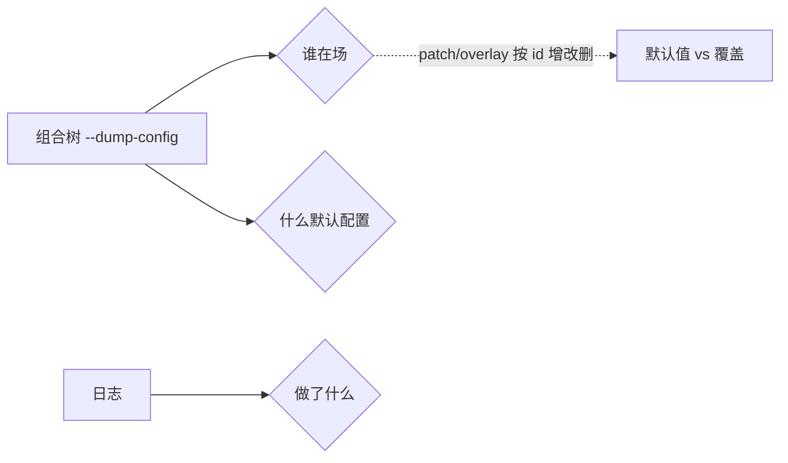
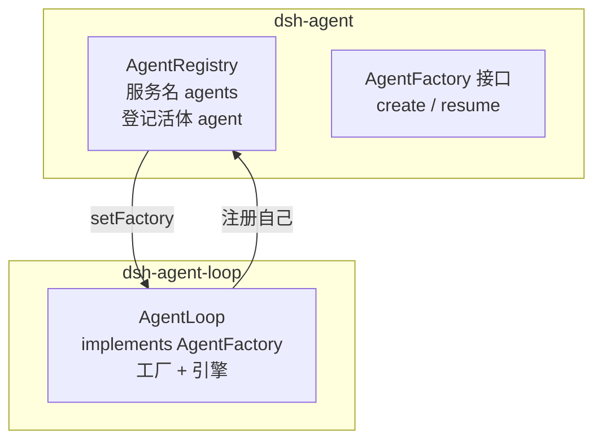

# 认知地图

状态：草稿（2026-08-17，完成实验 001 日志锚点后首次落笔）

## 提纲（已知 / 未知 / 猜测）

- **组合层**：已知「谁在场」由 `--dump-config` 回答，patch/overlay 按 id 增改删；未知 patch 层的完整合并语义。
- **spine（agent / agent-loop）**：已知 `AgentRegistry`（登记）与 `AgentFactory`（创建）接口/实现分离、`loop 可替换`；未知 `sessions`/`llm`/`tools`/`systemPrompt` 四个 inject 服务的提供者与职责。
- **工具管线**：已知 `tool-*` 插件注册工具 → `tools` 聚合 → 投影进 request；未知 Service Definition / Provider / Consumer 三角色的具体落地。
- **LLM 缝**：已知流式 chunk（block-start→delta→block-end）与聚合 message 的关系；未知真实 provider 的流式实现。
- **提示词装配**：已知「先 logged 后投影、投影会裁剪会重排」；未知投影实现代码（`deriveMessages()`/`assembleContextFor`）。
- **横切机制**：已知「模型可见⟺logged」、turn/step 继续条件、append-only + seq 引用 + `sourceEventSeqs` 三板斧。

## 详解

### 组合层（谁在场）

`--dump-config` 输出的是「组合树」：每个插件一行（id + name + config），行前 `# == ...` 注释标来源层（`dsh-base` / `patched by dsh-headless` / `dsh-headless`）。它只回答「谁在场 + 什么默认配置」，不回答「运行时发生了什么」。

默认值与覆盖是这一层的常态：模型默认 `deepseek-v4-flash`、可 patch 成 `cli-mock`；标题有兜底（`session-title`）+ 可叠加 LLM（`session-title-llm`）；agent 默认 `[]`（全按需）、可预置声明式 agent。

### spine（agent / agent-loop）

「登记」和「创建」分离，靠接口 `AgentFactory` 衔接：

- `inject:['agents']` 的 `agents` 是**服务**（`ctx.agents`，类型 `AgentRegistry`），由 `dsh-agent` 提供；`config.agents:[]` 是**配置数组**（启动时预置几个 agent）。同名不同物。
- `agent-loop` 是 `AgentFactory` 的**默认实现**，不是代码写死唯一——任何实现该接口的插件都可在组合树替换它，这是「loop 可替换」的根源。
- turn/step 由 loop 驱动：输入唤醒 loop（拉模型），loop 开 turn、认领 inbox、逐 step 循环，直到模型 `finish.reason=stop`。

### 工具管线

`tool-*` 插件各自注册一个工具，`tools` 插件聚合为清单，投影进 request 的 `header.tools`。日志只记「bash 被调用了」（`tool/call`/`tool/result`），「bash 是谁注册的」不在日志里、在组合树。这是「日志记行为、组合树记行为者」的体现。

### LLM 缝（流式）

模型流式输出 = 一个内容块（block）拆成多个事件块（chunk）：`block-start → delta → block-end`，`usage`/`finish` 是附属报告。chunk 保流式保真，`assistant/message` 是聚合投影，`sourceEventSeqs` 钉住「聚合体 → 原始碎片」。

### 提示词装配（投影）

「模型可见 ⟺ logged」：进模型的内容必先落日志，所以「发送 = 投影」——不需要专门 send 事件，因为发送的内容就是已 logged 的行。投影会**裁剪**（主请求装 system+历史+工具，起标题请求只装用户消息）也会**重排**（日志顺序=发生先后，请求顺序=system 在前历史在后）。`role` 与 `source.kind` 分离：前者标记「去路身份」，后者标记「来源身份」。

### 横切机制（三条不变量）

1. **模型可见 ⟺ logged**：任何进模型的东西都能从日志追溯；`role`（去路）/`source.kind`（来源）分离共同服务此信条。
2. **turn/step 继续条件**：`finish.reason=tool-calls` → 工具跑、结果喂回、开新 step；`stop` → turn 结束。一个 turn = 若干 step。
3. **日志三板斧**：`surfaceOp:append`（只增不改）、seq 号引用（指回不复制）、`sourceEventSeqs`（聚合体→原始碎片）。

## 已知的断层（下次要补）

- `sessions`/`llm`/`tools`/`systemPrompt` 四个 inject 服务的提供者与职责（只问了 `agents`）。
- 投影的实现代码（`deriveMessages()` / `assembleContextFor`）未读，只知道行为。
- 能力缝三角色（Service Definition / Provider / Consumer）仍是名词，未落地到具体包（shell 家族）。
