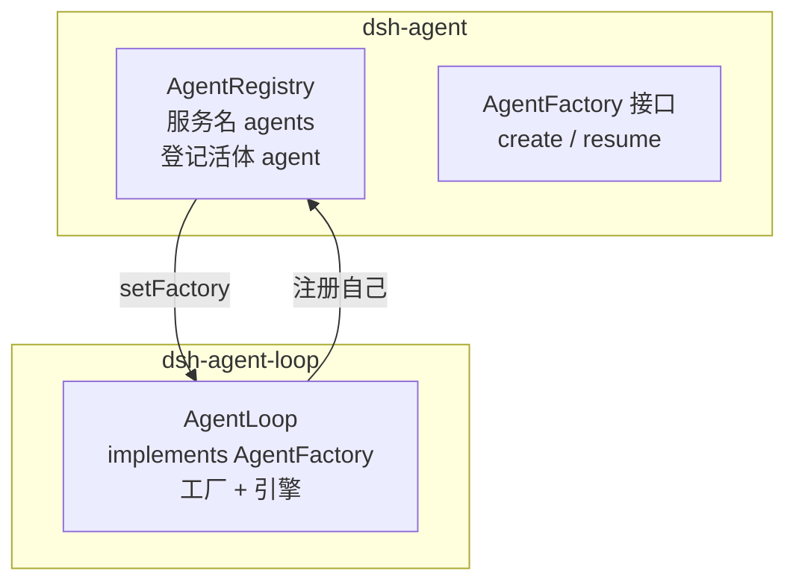

# packages/core 产品主干 学习笔记

状态：草稿 | 已对照验证（2026-08-17 对照 packages/core/README.zh.md、docs/architecture.zh.md、vendor/README.md）

## 事实源（链接，不复述）

- [packages/core/README.zh.md](../../../packages/core/README.zh.md) — core 组的包/职责/ctx key 表
- [docs/architecture.zh.md](../../../docs/architecture.zh.md) — Cordis 定位 + 核心包
- [vendor/README.md](../../../vendor/README.md) — Cordis 被 vendored 的说明

## 它是什么（用自己的话）

`packages/core` 是 harness 的「产品 API 主干」：构成默认控制主干的会话日志、系统提示词组装、工具注册表、agent 词汇、默认模型选择、具体循环。它是一组**用 Cordis 框架写的插件**，贡献出产品最核心的「控制流」；别的能力（shell/fs/web/subagent…）都作为「能力缝」挂在它旁边。

## 关键实体（逐个链接到 home）

| 包 | 职责 | ctx key | 分层 |
|---|---|---|---|
| `scope` | 作用域上下文注册原语 | 库，不用 ctx key | 第 0 层 |
| `session` | 事件溯源会话日志 + 内存存储 | `ctx.sessions` | 第 1 层 |
| `tools` | 作用域工具注册表 + 执行流水线 | `ctx.tools` | 第 1 层 |
| `system-prompt` | 提示词 + 工具 schema 组装注册表 | `ctx.systemPrompt` | 第 1 层 |
| `agent` | Agent 接口、注册表、事件词汇 | `ctx.agents` | 第 2 层 |
| `agent-default-model` | 默认模型选择 | `ctx.agentDefaultModel` | 第 2 层 |
| `agent-loop` | 默认具体 agent 驱动器 | `ctx.agentLoop` | 第 2 层 |

## 两套「分层」不要混淆

本笔记上表的「第 0/1/2 层」是 core **七包内部**的依赖分层（scope → 注册表 → 执行者），与 [learning-path.zh.md](../../learning-path.zh.md) 阶段 1 的「L0–L4 五层」是**两套不同的编号**：

- **「L0–L4 五层」是 learning-path 的教学重组，不是正式术语**。`L0`（Cordis 地基）→ `L1`（核心脊柱 spine = core 七包）→ `L2`（能力缝）→ `L3`（组合层）→ `L4`（接口层）。这套编号**只出现在 learning-path.zh.md**，`docs/architecture.zh.md` 与 `packages/README.zh.md` 里没有 L 编号——它们的权威形态是自然语言描述 + 组表。learning-path 自己在「文档性质」声明里点明「架构总览一节是既有事实的鸟瞰重组，不新增事实」。
- **本笔记的「第 0/1/2 层」是 core 组内部的细分**，对应关系：整个 core 七包 = 五层里的 **L1（spine）**；core 内部再分「scope（第 0 层库）→ 三个注册表（第 1 层）→ agent 三件套（第 2 层）」。
- **L2 能力缝里的 Service 与 seam**：两者是「同一能力的两种视角」——Service 是它「挂在 ctx 上的形态」（可 inject），seam 是它「可替换的三角色结构」。L2 的每个能力既是 Service 又是 seam；而 L1 的 spine 是 Service 但**不是** seam（不可替换）。

所以读到「第 0 层」别误当成「L0」：L0 指 Cordis 框架，而 scope 是 L1（spine）内部最底层的库。

## 与相邻单元的关系（依赖谁 / 被谁依赖）

- **依赖 Cordis**：每个包都是 Cordis 插件，通过 `ctx.effect()`/`ctx.on()` 贡献服务、类型化事件、可逆副作用。
- **三层自上而下依赖**：`scope`（地基）→ 三个注册表（session/tools/system-prompt）→ agent 三件套（agent/agent-default-model/agent-loop）。
- **agent-loop 是被组合的「引擎」**：它 `inject: ['agents','sessions','llm','tools','systemPrompt']`，把注册表串起来跑「调模型 → 跑工具 → 重复」的循环；具体能力（工具是什么、模型怎么调）全外挂。

## 我曾经的误解（原以为 → 实际是 → 修正来源）

1. **原以为** `packages/core` 是「核心代码目录」（普通的分层目录）；**实际是** 它是「产品主干」这组**插件包**的集合，本身也是插件，不是高于插件的特权内核。修正来源：docs/architecture.zh.md「产品的每一部分都是插件…不存在需要打补丁的特权内核」。
2. **原以为** core 里的包是平铺的；**实际是** 有明显三层：地基库（scope）→ 注册表（session/tools/system-prompt）→ 执行者（agent 三件套）。修正来源：packages/core/README.zh.md 的职责划分 + 本次梳理。

## 验证方式

- `pnpm dsh --profile headless --dump-config`：组合树里能直接看到 core 各插件（`session`、`tools`、`system-prompt`、`agent`、`agent-default-model`、`agent-loop`）在场。

## 重要辨析：core 插件「在场」≠「在日志里留名」

core 插件是「机制」，日志事件是「机制运转时产生的行为」，两者不是一一对应：

- 日志只记「发生了什么」（`turn/start`、`tool/call`…），不显式写「是谁做的」。
- 大部分 core 插件在日志里「隐身」，只留下行为痕迹：`session` 产出 `user/message`/`assistant/message`；`agent-loop` 驱动 `turn/start`/`step/end`；`tools` 只在被调用时以 `tool/call` 出现。
- 唯一显式署名的例外是 system-prompt：它写入的运行时上下文快照（seq 8）带 `source.plugin:"@deepseek-ai/dsh-system-prompt"`，因为「这条内容是谁注入的」必须让模型和读者可追溯。
- 「谁做的」要回 `--dump-config` 组合树查「谁在场」，再与日志行为**匹配**推断，组合树不直接点名。

## spine 的分工（agent / agent-loop 的接口/实现分离）

`agent` 和 `agent-loop` 是第 2 层「执行者」的核心，二者靠接口 `AgentFactory` 衔接，职责分离：

- **`agent` 定义接口 + 注册表**：`AgentFactory`（`create`/`resume`）是抽象接口，`AgentRegistry`（`ctx.agents`）是「登记活体 agent」的仓库。
- **`agent-loop` 是接口的默认实现**：`class AgentLoop extends Service implements AgentFactory`，通过 `setFactory` 注册自己，负责真正造 agent、驱动 turn/step。
- **两个 `agents` 同名不同物**：`inject:['agents']` 的 `agents` 是**服务**（`ctx.agents`，类型 `AgentRegistry`，由 `dsh-agent` 提供）；`config.agents:[]` 是**配置数组**（`agent-loop` 的字段，表示启动时预置几个声明式 agent，默认空 = 全按需）。
- **「默认」的精确含义**：不是代码写死唯一，而是预设组合树里选用了 `dsh-agent-loop` 作为 `AgentFactory` 的实现；任何实现该接口的插件都能替换它——这是「loop 可替换」的根源。
- turn/step 由 loop 驱动：输入唤醒 loop（拉模型），loop 开 turn、认领 inbox、逐 step 循环，直到模型 `finish.reason=stop`。

## 遗留问题（登记进 questions.zh.md）

- ~~目录里有 `agent-tool-presentation` 包，但 core README 表格未列——是遗漏、还是属于别的组？~~ **已查清**：`agent-tool-presentation` 是 preset 的「工具呈现方式」声明插件（`native`/`code`/`both`，调 `ctx.tools.presentAs()`），语义上挂在 preset 生态，不属于默认控制主干的 7 个包，故 core README 表格未列是文档有意安排，非遗漏。
- `scope` 的「作用域原语」具体机制尚未深读（第 0 层只知其名）。
