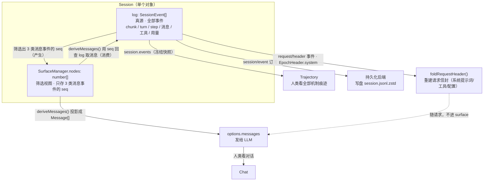

# 日志（log）学习笔记

状态：草稿 | 已对照验证（2026-08-22 对照 packages/core/session/src/index.ts、surface.ts、docs/subsystems/session.zh.md、packages/core/agent-loop/src/invariant.ts、packages/client/ui-trajectory/README.zh.md）

## 事实源（链接，不复述）

- [docs/subsystems/session.zh.md](../../../docs/subsystems/session.zh.md) — `SessionEventMap`、`SurfaceEventType`、投影规则
- [packages/core/session/src/index.ts](../../../packages/core/session/src/index.ts) — `Session` 类的 log / surface / deriveMessages
- [packages/core/session/src/surface.ts](../../../packages/core/session/src/surface.ts) — `SURFACE_EVENT_TYPES` 与 `deriveEventMessage`
- [packages/core/agent-loop/src/invariant.ts](../../../packages/core/agent-loop/src/invariant.ts) — 「模型可见 ⟺ logged」运行时断言
- [packages/client/ui-trajectory/README.zh.md](../../../packages/client/ui-trajectory/README.zh.md) — Trajectory 的数据源

## 它是什么（用自己的话）

「日志」是 harness 里一个贯穿多包的横切概念，核心是一个不变式：**「模型可见 ⟺ logged」——模型看到的任何内容，都必须能从会话日志重建**。为满足这个不变式，会话日志被设计成「一份仅追加真源 + 两套投影」：真源（`session.events`）完整记录一切；两套投影分别重建请求的两部分——**surface → `deriveMessages()` 重建「消息历史」**，**`request/header` → `foldRequestHeader()` 重建「请求信封」（系统提示词 + 工具 schema + 调用配置）**。

## 术语澄清：「事件溯源」「内存存储」「surface」「文件」

dsh-session 包 README 开头的「**事件溯源的会话日志和内存存储**」里，「事件溯源」和「内存存储」**不是「文件 vs surface」的对应关系**——两者都在内存，surface 是另一个概念，「文件」根本不是 dsh-session 包自己的术语。

| 概念 | 是什么 | 在哪 |
|---|---|---|
| **事件溯源的会话日志** | `Session` 的**数据模式**（append-only 事件数组，状态从事件派生） | `Session.log`（内存） |
| **内存存储** | `SessionStore` 的**定位**（持有 `Session` 实例、有意不落盘） | `ctx.sessions`（内存） |
| **surface** | 原始日志之上的「消息事件投影」 | `Session.surface`（内存，附属于 Session） |
| **文件** | 持久化后端（另一个包）把 `session.events` 序列化的产物 | 磁盘（不属于 dsh-session 包） |

关键纠正：

1. 「事件溯源的会话日志」和「内存存储」**不是对立的两个东西**，而是「`Session` 的存储模式」和「`SessionStore` 的定位」两个不同层面的描述，**都在内存**。
2. **「文件」不是这套术语的一部分**——dsh-session 包「有意不实现持久化」（README 第 11 行），落盘文件是**持久化后端**（订阅 `session/event` 的另一个包）写出去的。
3. surface 既不是「文件」也不是「内存存储」的别名，它是原始日志上的投影层，三者都在内存。

```
dsh-session 包（全在内存，不落盘）
│
├─ SessionStore（ctx.sessions）── 「内存存储」
│      │  持有多个 Session 实例
│      ▼
│   Session 实例 ── 「事件溯源的会话日志」
│      ├─ log: SessionEvent[]      ← 原始日志（append-only）
│      └─ surface.nodes: number[]  ← surface（消息事件投影）
│
└─ （持久化由其他包负责）订阅 session/event → 把 log 序列化成 session.jsonl.zstd 文件
```

所以「原始日志 = 文件、surface = 内存」是**误读**：把「落盘」这个外部动作误植进了 dsh-session 包的术语里。

## 核心重点一：surface 不是单独存在的

surface 不是一个独立的存储，它是**`Session` 对象内部的一个「索引」**。源码里二者是同一个对象里的两个成员（`packages/core/session/src/index.ts` 第 426–433 行）：

```ts
export class Session {
  private log: SessionEvent[] = []                      // 真源：全部事件
  private readonly surfaceManager = new SurfaceManager(this.log)  // 索引：只存消息事件的 seq
  get surface(): SessionSurface { return this.surfaceManager }
}
```

- **原始日志 `log`**：存全部 `SessionEvent`（含 chunk、边界、用量、消息、工具调用），是唯一真源，永不删改。
- **surface `nodes`**：只存「能产生消息的事件」的 **seq 序号**（`number[]`），不是消息本身、也不是第二份数据。

`deriveMessages()` 的流程（第 726–747 行）就是「读 nodes 的序号 → 回 log 里取事件 → 投影成消息」——**索引指向数据，不是两份数据并存**。

三者关系（同一个 `Session` 对象内的三层视图，非流水线）：



图读法：**surface 是 log 的筛选视图**——log 里只有 3 类「内嵌消息」的事件会被筛出、以 seq 序号记入 surface（实线「产生」方向）；反过来，`deriveMessages()` 用这些 seq 回查 log 取出消息（实线「消费」方向）。这两个方向合起来才是完整的「索引」语义：**产生时筛选、消费时回查**。真源向 Trajectory（回放）与持久化（落盘）流出；索引向模型（`options.messages`）流出，Chat 是这条路径的人类视图。右下角是**第二套重建**：系统提示词/工具 schema/调用配置作为 `request/header` 事件落日志，由 `foldRequestHeader()` 重建，**随请求发出但不进 surface**（虚线）。

## 核心重点二：surface 的目的是「重建」

surface 存在的**唯一目的**，是支撑「从日志重建模型历史」这个不变式。理由链：

1. 模型历史必须**能随时从日志重建**（不能只存在内存里，否则违反「模型可见 ⟺ logged」）。
2. 但日志里有大量**非消息事件**（`turn/*`、`step/*`、`assistant/chunk`、`todo/write`…），不能直接全塞给模型。
3. 所以需要一个「有序地标出哪些事件产生消息」的投影——这就是 surface。

`deriveMessages()` 就是「重建」这个动作的规范实现，而它**同时承担运行时校验**：`invariant.ts`（第 39–42 行）在每次请求时**独立**再调一次 `deriveMessages()`，把结果与实际发出的 `options.messages` 做 `JSON.stringify` 比对，不等即 fail（`log-reconstruction desync`）。

> 一句话：**surface 是为了「能重建」而生的索引；`deriveMessages()` 是「重建」动作；`invariant.ts` 是「重建必须吻合」的断言。**

### 两套重建机制

「重建」不只有 surface 一套——请求由两个正交的部分组成，各有各的重建机制：

| 请求的部分 | 落日志的事件 | 重建函数 | 投影产物 |
|---|---|---|---|
| 消息历史 | surface 事件（`user/message` / `assistant/message` / `tool/result`） | `deriveMessages()` | `options.messages` |
| 请求信封（系统提示词 + 工具 schema + 调用配置） | `request/header` 事件（`EpochHeader`） | `foldRequestHeader()` | `config` + `system` + `tools` |

所以「模型可见 ⟺ logged」由**两套投影共同满足**：消息历史走 surface 这套，系统提示词/工具/配置走 `request/header` 这套。这也是为什么系统提示词「不进 surface 但进日志」——它属于第二套，不属于第一套。

## 核心重点三：surface 筛哪三类消息，为什么是这三类

surface 只筛三类事件（源码硬编码，`surface.ts` 第 15–19 行）：

```ts
const SURFACE_EVENT_TYPES = new Set(['user/message', 'assistant/message', 'tool/result'])
```

**为什么是这三类**（权威依据 `docs/subsystems/session.zh.md`）：

> `SurfaceEventType` 是「`SessionEventType` 中**产生 LLM 消息**的那部分子集」，`SessionSurface.nodes` 是「**model-visible order**（模型可见顺序）」。

**本质因果（正向，而非从代码倒推）**：

> 这三类消息是**要发给大模型的**（model-visible），所以它们**必须能从日志重建**（「模型可见 ⟺ logged」不变式），所以它们**必须进 surface**。surface 是「模型可见内容」的投影，而不是「恰好内嵌消息的事件的投影」。

「内嵌完整 `Message`」只是**实现上的表现**（它们恰好用 payload 内嵌消息来承载），不是**设计的判据**。判据是「这条消息要不要进模型上下文」：

| 事件 | 是否模型可见 | 是否进 surface | 投影结果 |
|---|---|---|---|
| `user/message` | 是（输入/注入上下文） | 是 | 原样取出 |
| `assistant/message` | 是（模型回复） | 是 | 取出（空 content 则跳过） |
| `tool/result` | 是（工具结果给模型看） | 是 | 取出 |
| `turn/start`、`step/*`、`assistant/chunk`、`todo/write`、`llm/retry`… | 否（结构/回放/记账信息） | 否 | 不投影 |

所以「为什么是这三类」的答案是：**因为这三类是要进模型上下文的消息，必须可重建，故进 surface；其余事件不进模型，只服务于回放/记账，故不进 surface。**「内嵌消息」是这一判据在 payload 上的实现结果，不是原因。

（`surfaceOp` 字段作为「日志里的 surface 标记」的详细说明，见 [event-persistence.zh.md](event-persistence.zh.md) 的「结论三」。）

## 谁看哪一层（展示分工）

| 数据面 | 数据源 | 给谁 | 对应 UI |
|---|---|---|---|
| 原始日志 | `session.events` | 人类回放 / 持久化 | **Trajectory**（按 turn/step 组织，含 chunk/边界/用量/被打断记录，点开看 token/耗时） |
| surface 投影 | `deriveMessages()` | 模型 + 人类看对话 | **Chat**（消息流投影） |
| 请求信封 | `request/header` 事件 → `foldRequestHeader()` | 模型（请求时） | **Trajectory 的 `request/header` 记录**（点开看 `EpochHeader.system` 字段，非直接对话行） |

## 系统提示词为什么「不进 surface」

系统提示词是 `renderPrompt(assembly)` 的运行时产物，在 `llm/stream` 时点临时组装。它**不进 surface**，但**确实进日志**——作为 `request/header` 事件的 `EpochHeader.system` 字段落盘（`session.zh.md` 第 160 行：「渲染后的系统提示词」作为请求信封写入日志）。

**为什么它不进 surface**：因为 surface 的职责是「投影**消息历史**」（`deriveMessages()` → `messages`），而系统提示词属于「**请求信封**」（`EpochHeader`：config + system + tools），由**第二套投影** `foldRequestHeader()` 负责。请求由两个正交的部分组成：

| 部分 | 事件 | 重建函数 | 投影产物 |
|---|---|---|---|
| 消息历史 | surface 事件（3 类） | `deriveMessages()` | `options.messages` |
| 请求信封 | `request/header` | `foldRequestHeader()` | config + system + tools |

所以系统提示词**不违反「模型可见 ⟺ logged」**：它落日志了（`request/header`），可重建（`foldRequestHeader()`），只是不走「消息历史」这条 surface 路径。之前误以为它「不进日志」，是混淆了「不进 surface」和「不进日志」。

**在 UI 里怎么看**：Trajectory 读原始日志，能看到 `request/header` 事件，点开它的 `EpochHeader.system` 字段就能看到渲染后的系统提示词全文——它不是作为对话行直接展示，而是藏在 `request/header` 记录里。Chat 视图（surface 投影）则永远看不到它。

## 我曾经的误解（原以为 → 实际是）

1. 原以为「日志」是单一概念 → 实际是「真源（原始日志）+ 索引（surface）+ 投影（deriveMessages）」三层，各司其职。
2. 原以为 surface 是「一份独立的数据/存储」 → 实际是 `Session` 内部的一个 seq 序号索引，指向 log。
3. 原以为 `deriveMessages()` 是「过滤给 LLM 看」→ 实际是「投影 + 可重建断言」双重职责，核心目的是**重建**。
4. 原以为 surface 的「三类」是经验归类 → 实际判据是「事件 payload 是否内嵌完整 LLM 消息」，源码硬编码三种。
5. 原以为系统提示词「不进日志、哪里都看不到」→ 实际它**进日志**（`request/header` 的 `EpochHeader.system`），只是**不进 surface**；Trajectory 点开 `request/header` 记录能看到，Chat 看不到。之前混淆了「不进 surface」与「不进日志」。

## 验证方式

- 源码级：`deriveMessages()` 闭环见 `session/src/index.ts` 第 726–747 行；`SURFACE_EVENT_TYPES` 见 `surface.ts` 第 15–19 行；invariant 比对见 `agent-loop/src/invariant.ts` 第 39–42 行。
- 运行时级：llm-inspector 实验（experiments/002）的 `options.system` / `options.messages` 可直接观察；Trajectory（web profile）可观察原始日志。

## 遗留问题（登记进 questions.zh.md）

- `replace` 操作（compaction）如何触发 surface 遮蔽、`assertToolResultRewrite` 的「只改 content」不变式——见 [notes/modules/session.zh.md](../modules/session.zh.md) 遗留问题。
