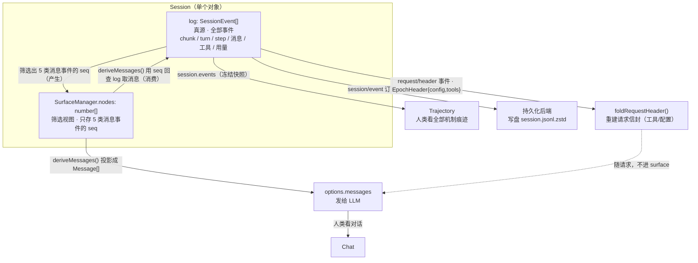

# 日志（log）学习笔记

状态：草稿 | 已对照验证（2026-08-22 对照 packages/core/session/src/index.ts、surface.ts、docs/subsystems/session.zh.md、packages/core/agent-loop/src/invariant.ts、packages/client/ui-trajectory/README.zh.md）｜已对照 0.1.2-alpha.4（2026-09-02：`SessionSeq`/`SessionLogOffset` 引入、`SessionHeader.seedLength` 移除，见下方「seq 与 log offset 的类型分离」；行号引用刷新）｜已对照 0.1.7-rc.1（2026-09-24：session format v0→v4，surface 三类→五类、系统提示词从 `request/header` 升格为 `system/message`，见下方「surface 五类」与「系统提示词进 surface」；详见 [session-format.zh.md](session-format.zh.md)）

## 事实源（链接，不复述）

- [docs/subsystems/session.zh.md](../../../docs/subsystems/session.zh.md) — `SessionEventMap`、`SurfaceEventType`、投影规则
- [packages/core/session/src/index.ts](../../../packages/core/session/src/index.ts) — `Session` 类的 log / surface / deriveMessages
- [packages/core/session/src/surface.ts](../../../packages/core/session/src/surface.ts) — `SURFACE_EVENT_TYPES` 与 `deriveEventMessage`
- [packages/core/agent-loop/src/invariant.ts](../../../packages/core/agent-loop/src/invariant.ts) — 「模型可见 ⟺ logged」运行时断言
- [packages/client/ui-trajectory/README.zh.md](../../../packages/client/ui-trajectory/README.zh.md) — Trajectory 的数据源

## 它是什么（用自己的话）

「日志」是 harness 里一个贯穿多包的横切概念，核心是一个不变式：**「模型可见 ⟺ logged」——模型看到的任何内容，都必须能从会话日志重建**。为满足这个不变式，会话日志被设计成「一份仅追加真源 + 两套投影」：真源（`session.events`）完整记录一切；两套投影分别重建请求的两部分——**surface → `deriveMessages()` 重建「消息历史」（含系统提示词）**，**`request/header` → `foldRequestHeader()` 重建「请求信封」（工具 schema + 调用配置）**。系统提示词自 0.1.7-rc.1（session format v3）起已从 `request/header` 升格为 surface 的 `system/message` 节点，不再属于「请求信封」。

## 术语澄清：「事件溯源」「内存存储」「surface」「文件」

dsh-session 包 README 开头的「**事件溯源的会话日志和内存存储**」里，「事件溯源」和「内存存储」**不是「文件 vs surface」的对应关系**——两者都在内存，surface 是另一个概念，「文件」根本不是 dsh-session 包自己的术语。

| 概念 | 是什么 | 在哪 |
|---|---|---|
| **事件溯源的会话日志** | `Session` 的**数据模式**（append-only 事件数组，状态从事件派生） | `Session.log`（内存） |
| **内存存储** | `SessionStore` 的**定位**（持有 `Session` 实例、有意不落盘） | `ctx.sessions`（内存） |
| **surface** | 原始日志之上的「消息事件投影」 | `Session.surface`（内存，附属于 Session） |
| **文件** | 持久化后端（另一个包）把 `session.events` 序列化的产物 | 磁盘（不属于 dsh-session 包） |

关键纠正：

1. 「事件溯源的会话日志」和「内存存储」**不是对立的两个东西**，而是「`Session` 的存储模式」和「`SessionStore` 的定位」两个不同层面的描述，**都在内存**。
2. **「文件」不是这套术语的一部分**——dsh-session 包「有意不实现持久化」（README 第 11 行），落盘文件是**持久化后端**（订阅 `session/event` 的另一个包）写出去的。
3. surface 既不是「文件」也不是「内存存储」的别名，它是原始日志上的投影层，三者都在内存。

```
dsh-session 包（全在内存，不落盘）
│
├─ SessionStore（ctx.sessions）── 「内存存储」
│      │  持有多个 Session 实例
│      ▼
│   Session 实例 ── 「事件溯源的会话日志」
│      ├─ log: SessionEvent[]      ← 原始日志（append-only）
│      └─ surface.nodes: number[]  ← surface（消息事件投影）
│
└─ （持久化由其他包负责）订阅 session/event → 把 log 序列化成 session.jsonl.zstd 文件
```

所以「原始日志 = 文件、surface = 内存」是**误读**：把「落盘」这个外部动作误植进了 dsh-session 包的术语里。

## 核心重点一：surface 不是单独存在的

surface 不是一个独立的存储，它是**`Session` 对象内部的一个「索引」**。源码里二者是同一个对象里的两个成员（`packages/core/session/src/index.ts` 第 426–433 行）：

```ts
export class Session {
  private log: SessionEvent[] = []                      // 真源：全部事件
  private readonly surfaceManager = new SurfaceManager(this.log)  // 索引：只存消息事件的 seq
  get surface(): SessionSurface { return this.surfaceManager }
}
```

- **原始日志 `log`**：存全部 `SessionEvent`（含 chunk、边界、用量、消息、工具调用），是唯一真源，永不删改。
- **surface `nodes`**：只存「能产生消息的事件」的 **seq 序号**（`number[]`），不是消息本身、也不是第二份数据。

`deriveMessages()` 的流程（第 790 行起）就是「读 nodes 的序号 → 回 log 里取事件 → 投影成消息」——**索引指向数据，不是两份数据并存**。

三者关系（同一个 `Session` 对象内的三层视图，非流水线）：


```mermaid
flowchart TB
    subgraph S["Session（单个对象）"]
        log["log: SessionEvent[]<br/>真源 · 全部事件<br/>chunk / turn / step / 消息 / 工具 / 用量"]
        surface["SurfaceManager.nodes: number[]<br/>筛选视图 · 只存 5 类消息事件的 seq"]
        log --"筛选出 5 类消息事件的 seq（产生）"--> surface
        surface --"deriveMessages() 用 seq 回查 log 取消息（消费）"--> log
    end

    log -->|"session.events（冻结快照）"| UI1["Trajectory<br/>人类看全部机制痕迹"]
    log -->|"session/event 订阅"| P["持久化后端<br/>写盘 session.jsonl.zstd"]

    surface -->|"deriveMessages() 投影成 Message[]"| MSG["options.messages<br/>发给 LLM"]
    MSG -->|"人类看对话"| UI2["Chat"]

    log -->|"request/header 事件 · EpochHeader{config,tools}"| HDR["foldRequestHeader()<br/>重建请求信封（工具/配置）"]
    HDR -.->|"随请求，不进 surface"| MSG
```

图读法：**surface 是 log 的筛选视图**——log 里只有 5 类「内嵌消息」的事件会被筛出、以 seq 序号记入 surface（实线「产生」方向）；反过来，`deriveMessages()` 用这些 seq 回查 log 取出消息（实线「消费」方向）。这两个方向合起来才是完整的「索引」语义：**产生时筛选、消费时回查**。真源向 Trajectory（回放）与持久化（落盘）流出；索引向模型（`options.messages`）流出，Chat 是这条路径的人类视图。右下角是**第二套重建**：工具 schema/调用配置作为 `request/header` 事件落日志，由 `foldRequestHeader()` 重建，**随请求发出但不进 surface**（虚线）。系统提示词已不在 `request/header` 里——它走 surface（`system/message`，见下方「系统提示词进 surface」）。

## 核心重点二：surface 的目的是「重建」

surface 存在的**唯一目的**，是支撑「从日志重建模型历史」这个不变式。理由链：

1. 模型历史必须**能随时从日志重建**（不能只存在内存里，否则违反「模型可见 ⟺ logged」）。
2. 但日志里有大量**非消息事件**（`turn/*`、`step/*`、`assistant/chunk`、`todo/write`…），不能直接全塞给模型。
3. 所以需要一个「有序地标出哪些事件产生消息」的投影——这就是 surface。

`deriveMessages()` 就是「重建」这个动作的规范实现，而它**同时承担运行时校验**：`invariant.ts`（第 39–42 行）在每次请求时**独立**再调一次 `deriveMessages()`，把结果与实际发出的 `options.messages` 做 `JSON.stringify` 比对，不等即 fail（`log-reconstruction desync`）。

> 一句话：**surface 是为了「能重建」而生的索引；`deriveMessages()` 是「重建」动作；`invariant.ts` 是「重建必须吻合」的断言。**

### 两套重建机制

「重建」不只有 surface 一套——请求由两个正交的部分组成，各有各的重建机制：

| 请求的部分 | 落日志的事件 | 重建函数 | 投影产物 |
|---|---|---|---|
| 消息历史（系统提示词 + 对话消息） | surface 事件（`system/message` / `user/message` / `assistant/message` / `developer/message` / `tool/result`） | `deriveMessages()` | `options.messages` |
| 请求信封（工具 schema + 调用配置） | `request/header` 事件（`EpochHeader`） | `foldRequestHeader()` | `config` + `tools` |

所以「模型可见 ⟺ logged」由**两套投影共同满足**：消息历史（含系统提示词）走 surface 这套，工具 schema/调用配置走 `request/header` 这套。0.1.7-rc.1（session format v3）之前系统提示词确实「不进 surface 但进日志」（藏在 `EpochHeader.system`），v3 起它升格为 surface 的 `system/message` 节点（node 0），`EpochHeader` 不再有 `system` 字段——这条历史结论已被推翻，见下方「系统提示词进 surface」。

### request/header 的 series 语义（0.1.2-alpha.2 增量）

`request/header` 的 `reason` 从 3 值扩为 4 值，新增「model-message series」分段语义（判定在 `agent-loop/src/agent.ts` 的 `buildRequest`）：

| reason | 触发条件 |
|---|---|
| `initial` | 首次请求，无 baseline header |
| `resume` | 首次 append 但已有 baseline（恢复会话） |
| `change` | header 内容变了（config/tools 任一变化；system 已随 v3 移出 header） |
| `series` | header 没变，但 surface 的 `replaceGeneration` 变了（消息历史被替换，如 compaction） |

`startsSeries: true` 是「header 变化**同时**开启新 series」的标记。agent-loop 用 `requestSurfaceGeneration` 记录上一次请求时的 surface `replaceGeneration`，一旦 surface 被替换（`replaceGeneration` 递增），即使信封没变也 append `reason:'series'`——因为「发给模型的消息序列」已经换了一拨。

> 一句话：`request/header` 不只是「请求信封变化的记录」，还承载「模型消息序列分段」的语义；`surface.replaceGeneration` 是「消息历史被替换」的计数器。

**0.1.7-rc.1 增量：系统提示词变化也触发 series**。v3 起系统提示词是 surface 的 `system/message`（node 0），prompt 变化走「replace node 0」——它同样让 `replaceGeneration` 递增，所以「prompt 变了、但 config/tools 没变」的请求在日志里表现为：一条 `system/message` replace + 一个 `reason: 'series'` 的 `request/header`（而非 `change`）。这正是「`headerEquals` 不再比较 `system`」的直接后果——prompt 变化和 tool/config 变化从此在日志里可区分。

**`replaceGeneration` 的触发链路**（谁让这个计数器递增，2026-09-01 追通）：

1. **递增点**：`surface.ts` 的 `applySurfacePlan`——事件带 `surfaceOp: { op: 'replace', start, end }` 时，`nodes.splice(...)` 用新节点替换 surface 的 start..end 段，并 `replaceGeneration += 1`。这是「投影视图上的位置替换」，不是日志替换（日志 append-only 不变）。
2. **生产者（compaction 生态）**：`compaction-basic` 的 `commitCompactionBody` 用摘要 checkpoint 替换历史（`append('user/message', checkpoint, { surfaceOp: { op: 'replace', start, end }, sourceEventSeqs })`）；`compaction-tool-result-pruner` 的 `pruneSession` 用修剪版替换超预算 tool/result（单节点 replace）。`sourceEventSeqs` 必须包含所有被遮蔽节点（provenance 证明，缺失即 fail）。
3. **闭环**：compaction 压力超限 → 生成摘要 → append 带 replace 的 checkpoint → surface `replaceGeneration` 递增 → 下一个 step 的 `buildRequest` 发现 generation 变了 → `append('request/header', { reason: 'series' })`。

### 第三套投影：sessionProjections（0.1.2-alpha.2 增量）

「模型可见 ⟺ logged」由上面两套重建投影满足；此外还有**第三套** `ctx.sessionProjections`（会话投影注册表），它**不**服务「模型可见」，而是折叠「客户端/宿主可见的派生状态」（todo 清单、goal 快照、turn 边界）。三者都「从日志派生」，但目的正交——详见 [session-projection.zh.md](session-projection.zh.md)。

### seq 与 log offset 的类型分离（0.1.2-alpha.4 增量）

0.1.2-alpha.4 起，日志里的两种「数值位置」在**类型层**被强制区分（`@deepseek-ai/dsh-brand` 的 `BrandedNumber<B>`，见 `types.ts`）——此前同一 `number` 类型同时表达两种不兼容含义：

| brand | 指什么 | 例 |
|---|---|---|
| `SessionSeq` | **一条已存在的事件**（事件身份） | `SessionEvent.seq`、surface `nodes`、`surfaceOp.replace` 端点、`sourceEventSeqs`、`SessionSeqCursor = SessionSeq \| -1` |
| `SessionLogOffset` | **日志间隙/前缀长度/读取切点**（可等于事件总数） | `Session.seq`、`firstLiveSeq`、`inheritedEventCount`、带正文读取的偏移 |

判断口诀：**seq 是「第几条」的身份，offset 是「切到哪」的边界**——surface 节点、provenance 指向已存在事件所以是 `SessionSeq`；继承前缀长度、watermark、读取切点落在事件间隙所以是 `SessionLogOffset`。`number` 只有在带正文解析/验证后才重新进入任一领域（验证构造函数拒绝负数/小数/非安全整数）。

连带变化：逻辑 `SessionHeader.seedLength`（数值）→ `isSeeded: boolean` + 带正文 observation 的 `inheritedEventCount: SessionLogOffset`；`Session.ownEvents()`/`isOwnSeq()` 向普通 consumer 隐藏比较。磁盘 v0 JSONL 字节兼容、API/SDK wire 仍是普通 number（adapter 在入 domain code 时验证）。

对「日志三层模型」结论的影响：**行为无变化**（append-only、surface seq 引用、deriveMessages 重建都不变），这是「类型卫生」加固——防止把事件身份与间隙位置混用导致迁移漏改；也不推翻「`surface.nodes` 是 seq 序号索引」的说法，只是该序号现在是 `SessionSeq`。权威记录见 2026-08-31 `session-sequence-and-log-offset-brands` Agent Note。

## 核心重点三：surface 筛哪五类消息，为什么是这几类

surface 只筛五类事件（源码硬编码，`surface.ts` 第 50–56 行）：

```ts
const SURFACE_EVENT_TYPES = new Set([
  'system/message',
  'developer/message',
  'user/message',
  'assistant/message',
  'tool/result',
])
```

**为什么是这几类**（权威依据 `docs/subsystems/session.zh.md`）：

> `SurfaceEventType` 是「`SessionEventType` 中**产生 LLM 消息**的那部分子集」，`SessionSurface.nodes` 是「**model-visible order**（模型可见顺序）」。

**本质因果（正向，而非从代码倒推）**：

> 这几类消息是**要发给大模型的**（model-visible），所以它们**必须能从日志重建**（「模型可见 ⟺ logged」不变式），所以它们**必须进 surface**。surface 是「模型可见内容」的投影，而不是「恰好内嵌消息的事件的投影」。

「内嵌完整 `Message`」只是**实现上的表现**（它们恰好用 payload 内嵌消息来承载），不是**设计的判据**。判据是「这条消息要不要进模型上下文」：

| 事件 | 是否模型可见 | 是否进 surface | 投影结果 |
|---|---|---|---|
| `system/message` | 是（系统提示词，wire message 0） | 是 | 取出（空 content 则投影 null，占位但不发） |
| `developer/message` | 是（工具变更指令） | 是 | 取出 |
| `user/message` | 是（输入/注入上下文） | 是 | 原样取出 |
| `assistant/message` | 是（模型回复） | 是 | 取出（空 content 则跳过） |
| `tool/result` | 是（工具结果给模型看，v4 起 role=tool） | 是 | 取出 |
| `turn/start`、`step/*`、`todo/write`、`llm/retry`… | 否（结构/回放/记账信息） | 否 | 不投影 |

所以「为什么是这几类」的答案是：**因为这几类是要进模型上下文的消息，必须可重建，故进 surface；其余事件不进模型，只服务于回放/记账，故不进 surface。**「内嵌消息」是这一判据在 payload 上的实现结果，不是原因。

**从「三类」到「五类」的演进（session format v3/v4）**：旧结论「`user/message`/`assistant/message`/`tool/result` 三类」是 0.1.2-alpha.4 之前的事实。v3 把系统提示词从 `request/header` 升格为 `system/message`（surface node 0）；v4 把 `tool/result` 的 message 从 `role:'user'` 改为 `role:'tool'`（去掉 `tool-result` 包装块），并新增 `developer/message`（工具变更指令）。`assistant/chunk` 也随 v2 从顶层事件内嵌进 `assistant/message.stream`，但无论新旧它都不进 surface——进 surface 的判据始终是「产生 LLM 消息」。

（`surfaceOp` 字段作为「日志里的 surface 标记」的详细说明，见 [event-persistence.zh.md](event-persistence.zh.md) 的「结论三」。）

## 谁看哪一层（展示分工）

| 数据面 | 数据源 | 给谁 | 对应 UI |
|---|---|---|---|
| 原始日志 | `session.events` | 人类回放 / 持久化 | **Trajectory**（按 turn/step 组织，含 chunk/边界/用量/被打断记录，点开看 token/耗时） |
| surface 投影 | `deriveMessages()` | 模型 + 人类看对话 | **Chat**（消息流投影） |
| 请求信封 | `request/header` 事件 → `foldRequestHeader()` | 模型（请求时） | **Trajectory 的 `request/header` 记录**（点开看 config/tools，非直接对话行） |

## 系统提示词进 surface（node 0）

**历史结论（v3 之前，已被推翻）**：系统提示词是 `renderPrompt(assembly)` 的运行时产物，藏在 `request/header` 的 `EpochHeader.system` 字段，「不进 surface 但进日志」，由第二套投影 `foldRequestHeader()` 重建。这是 0.1.2-alpha.4 之前的事实。

**现在（session format v3 起）**：系统提示词是一个普通的 surface 事件 `system/message`，落成 surface 的 **node 0**（第一个 step 的第一条消息）。`EpochHeader` 不再有 `system` 字段（`{ config, adapterDefaults?, tools? }`），`deriveMessages()` 折叠出来第一条就是 system 消息（wire message 0）。空 content 的 system 节点投影为 null（占位但不发）。

**为什么是 node 0 而不是「session 最前」**：系统提示词是 **per-request 动态渲染**的（随 preset/工具变化），不是 session 常量；而 `system/message` 升格为 surface 事件后必须带 `{ turn, step }` 坐标——step 之前没有可用的 step 坐标，所以它落成第一个 step 的第一条消息。「session 最开头」的直觉对应的是**投影结果**（折叠后 system 是 message 0），不是**落盘坐标**。日志里它的位置紧随第一个 `step/start`，正是 `log order = wire order` 的体现。

**为什么先插空 system/message 再替换**：让「系统提示词第一次变非空」也走 **replace node 0** 而不是 **append**。append 会把它加到 user 历史之后（破坏「system 必须是头」的位置不变量，pi-ai 会把后置 system 当 user 消息）；replace node 0 天然保持它最前。空 head 是「钉住 node 0」的受保护占位锚点（`assertSystemHeadRewrite`：只有 system/message 能 replace 覆盖 node 0 的 system 节点），`deriveEventMessage` 投影为 null 不产生 wire 消息。

**改变后的语义**：prompt 变化 → replace node 0 → `replaceGeneration` 递增 → 下一个 `request/header` 记 `reason: 'series'`（而非 `change`）。已发出的历史请求重建时仍带它当时的旧 system（append-only + replace 遮蔽，互不污染）——改变的生效点永远是「下一次请求」。

**在 UI 里怎么看**：Trajectory 读原始日志能看到 `system/message` 事件（点开看渲染后的提示词全文）；Chat 视图（surface 投影）折叠出 wire message 0 的 system 消息。两者现在一致地来自同一个 surface 节点。

## 我曾经的误解（原以为 → 实际是）

1. 原以为「日志」是单一概念 → 实际是「真源（原始日志）+ 索引（surface）+ 投影（deriveMessages）」三层，各司其职。
2. 原以为 surface 是「一份独立的数据/存储」 → 实际是 `Session` 内部的一个 seq 序号索引，指向 log。
3. 原以为 `deriveMessages()` 是「过滤给 LLM 看」→ 实际是「投影 + 可重建断言」双重职责，核心目的是**重建**。
4. 原以为 surface 的「三类」是经验归类 → 实际判据是「事件 payload 是否内嵌完整 LLM 消息」，源码硬编码；**但「三类」本身已被 v3/v4 推翻为五类**（+`system/message`、`developer/message`，`tool/result` 改 role=tool），判据「模型可见 ⟺ 进 surface」不变。
5. 原以为系统提示词「不进日志、哪里都看不到」→ 实际它**进日志**（`request/header` 的 `EpochHeader.system`），只是**不进 surface**（v3 之前的结论）；Trajectory 点开 `request/header` 记录能看到，Chat 看不到。**v3 起这条结论又被推翻**：系统提示词升格为 surface 的 `system/message`（node 0），`EpochHeader` 不再有 system。真正的稳定不变量只有「模型可见 ⟺ logged」，它的具体承载形态（header 字段还是 surface 节点）会随格式版本漂移。
6. 原以为「系统提示词每个 step 渲染一次」=「每个 step 重复发送」；实际「**渲染**（本地计算）/ **投影**（决定落盘）/ **发送**（wire）」是三个独立动作，渲染零 token、投影通常 no-op、发送是 LLM 无状态 API 的固有成本，v2/v3 都如此。

## 验证方式

- 源码级：`deriveMessages()` 闭环见 `session/src/index.ts` 第 790 行起；`SURFACE_EVENT_TYPES`（五类）见 `surface.ts` 第 50–56 行；`assertSystemHeadRewrite`（node 0 保护）见 `surface.ts` 第 493–513 行；invariant 比对见 `agent-loop/src/invariant.ts` 第 39–42 行。
- 运行时级：llm-inspector 实验（experiments/002）的 `options.system` / `options.messages` 可直接观察；Trajectory（web profile）可观察原始日志。

## 遗留问题（登记进 questions.zh.md）

- ~~`replace` 操作（compaction）如何触发 surface 遮蔽、`assertToolResultRewrite` 的「只改 content」不变式~~ **已解答**（2026-09-01）：见上方「request/header 的 series 语义」的「replaceGeneration 触发链路」——compaction 生态构造 replace，`assertToolResultRewrite` 校验 tool/result 替换只改 content。
