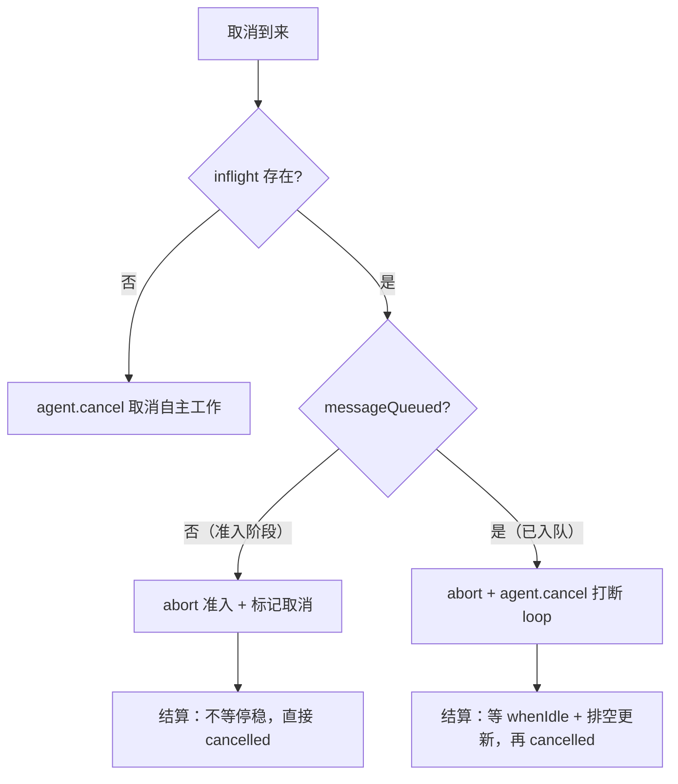
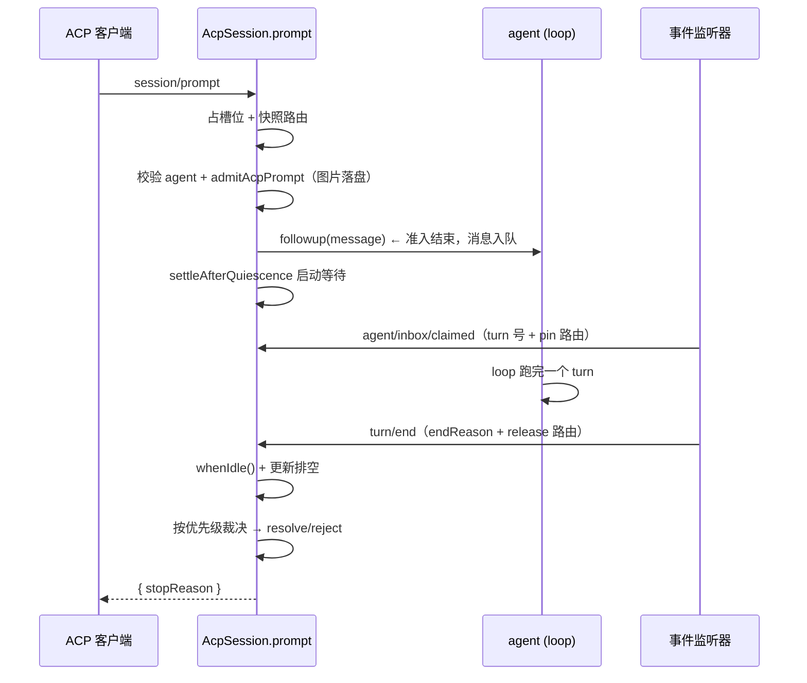

# acp 学习笔记

状态：草稿 | 已对照验证（2026-09-03 对照 packages/acp/acp/README.zh.md、src/index.ts、src/session.ts、src/content.ts、src/model-control.ts、src/codec.ts、src/mcp.ts、src/updates.ts、tests/harness.ts、.agents/notes/implemented/simplification/2026-07-23-acp-automation-only-protocol.zh.md、.agents/notes/implemented/feature/2026-06-14-acp-multi-session.zh.md）

## 事实源（链接，不复述）

- [packages/acp/acp/README.zh.md](../../../packages/acp/acp/README.zh.md) — 协议约定、三条设计承诺、已知限制（唯一权威包契约）
- [packages/acp/acp/src/index.ts](../../../packages/acp/acp/src/index.ts) — 插件入口：inject、事件接线、方法实现、连接生命周期
- [packages/acp/acp/src/session.ts](../../../packages/acp/acp/src/session.ts) — `AcpSession`：准入/结算/取消/关闭
- [packages/acp/acp/src/content.ts](../../../packages/acp/acp/src/content.ts) — 内容准入与投影（图片校验、路由重查、提示词重建）
- [packages/acp/acp/src/model-control.ts](../../../packages/acp/acp/src/model-control.ts) — 模型/reasoning_effort 配置 + turn 级 pin
- [.agents/notes/implemented/simplification/2026-07-23-acp-automation-only-protocol.zh.md](../../../.agents/notes/implemented/simplification/2026-07-23-acp-automation-only-protocol.zh.md) — 「仅面向自动化」定位决策
- [.agents/notes/implemented/feature/2026-06-14-acp-multi-session.zh.md](../../../.agents/notes/implemented/feature/2026-06-14-acp-multi-session.zh.md) — 多会话隔离与归属
- [packages/bundle/acp-app/README.zh.md](../../../packages/bundle/acp-app/README.zh.md) — `dsh --profile acp` 装配（latch 启动 + stdout 纯净）
- [packages/subagent/subagent-acp/README.zh.md](../../../packages/subagent/subagent-acp/README.zh.md) — 驱动本服务器的客户端

## 它是什么（用自己的话）

ACP 是 L4 接口层的一员：一个「仅面向自动化」的协议传输层，把 `ctx.agents`（Agent 接口）暴露成标准 ACP v1 stdio 服务器。受信程序（进程外 subagent、测试运行器、脚本控制器）经它创建/恢复/关闭持久会话、挂 MCP、选模型与推理强度、发提示词、收语义更新、答权限。它只发「已提交语义事实」，不发 DSH 私有呈现数据；它不依赖 agent-loop 实现，反过来被 `dsh-subagent-acp` 作为客户端 spawn 驱动。

## 关键实体（逐个链接到 home）

- `apply(ctx, config)`：插件入口，`inject = ['agents', 'llm', 'sessionPersistence', 'sessions']`，维护 `Map<SessionId, AcpSession>`。
- `AcpSession`：每会话模块，拥有 Agent handle、MCP 挂载、模型选择、提示词槽位、更新链（`outputTail`）、记忆化关闭（`closing`）。
- `InflightPrompt`：准入与结算共享的状态结构（`messageQueued`/`turn`/`endReason`/`cancelRequested`/`resolve`/`reject`）。
- `admitAcpPrompt` / `assistantBlockToAcp`：内容准入（ACP 块 → 核心块，图片落盘）与反向投影。
- `AcpModelControl`：`model`/`reasoning_effort` 标准配置选项；`pinTurn`/`releaseTurn` 把路由固定到一个 turn 的每个 model step。
- `turnEndToStopReason`：harness `TurnEndReason` → ACP `StopReason` 纯映射。
- `mountAcpMcpServers`：ACP stdio/HTTP MCP 声明 → DSH MCP client 配置（发布前校验）。

## 核心机制：准入 → 结算 → 取消

一次 prompt 的生命周期被 `agent.followup(message)` 这一行切成两段：入队前是**准入（admission）**，入队后是**结算（settlement）**。取消也按同一条分界线分两段——分界线始终是 `InflightPrompt.messageQueued` 一个字段。它们共享的 `InflightPrompt` 结构体就是传话区：字段由不同阶段写入，最终由结算读取并 `resolve`/`reject` 那个一开始就建好的 `completion` promise。

| `InflightPrompt` 字段 | 谁写 | 何时写 |
|---|---|---|
| `messageId` / `messageQueued` | 准入 | 消息构造好、成功入队后 |
| `turn` | 事件 `agent/inbox/claimed` | loop 认领消息、分配 turn 号后 |
| `endReason` | 事件 `turn/end` | 该 turn 结束后 |
| `outputError` / `agentError` | 失败路径 | 更新交付失败 / agent 区间失败 |
| `cancelRequested` | 取消路径 | `cancel()` / 连接关闭 |
| `resolve` / `reject` | 结算 | 最终裁决时 |

### 准入：入队前的一次性同步校验

准入在 `prompt()` 里完成（`src/session.ts:278-302`），做四件事，任何一步失败则消息**根本不进 inbox**（loop 不会跑）：

1. **快照路由**：`modelControl.snapshot()` 冻结此刻的 provider/model/reasoning_effort，供这一轮每个 model step 复用（后面 `pinTurn` 用）。
2. **校验 Agent 身份**：`ctx.agents.get(id) !== this.agent` 检查两次，确认没被外部 dispose。
3. **翻译内容**：`admitAcpPrompt` 把 ACP 块（text/resource_link/image）翻译成核心块，图片要解码/校验 base64/落盘成附件引用。
4. **入队**：`createUserMessage` 造消息 → `followup()` 送进 inbox，同时把快照路由挂到 `pendingSelections`（按 messageId 索引）。

本质是「拒绝发生在副作用之前」——宁可现在拒绝，也不让一个坏消息进 inbox。

### 结算：入队后的事件驱动裁决

结算在 `settleAfterQuiescence()` 里（`src/session.ts:486-516`），分两层：

1. **先等停稳**：`admissionDone`（准入完成）→ `agent.whenIdle()`（agent 空闲）→ `outputTail`（已提交更新全部发完）。
2. **再按优先级裁决**：显式取消 → 输出失败 → agent 失败 → 关联 turn 结束，各自对应 `inflight` 上的一个字段。

它是「被事件喂出来的」，不是主动轮询：`agent/inbox/claimed` 事件把 turn 号填进 inflight（并 pin 路由，`onInboxClaimed`），`turn/end` 事件把结束原因填进 inflight（`onSessionEvent` 的 finally 分支）。

### 取消：按 messageQueued 分两段

所有取消（`session/cancel`、`$/cancel_request`、连接关闭）汇到同一个 `cancelPrompt`（`src/session.ts:477-484`）：

```ts
private cancelPrompt(detail: string): void {
  const inflight = this.inflight
  if (inflight === undefined) return
  inflight.cancelRequested = true
  inflight.admissionController.abort(new Error(detail))
  this.settleAfterQuiescence(inflight)
  if (inflight.messageQueued) this.agent.cancel({ kind: 'user' })
}
```

最后一句 `if (inflight.messageQueued) agent.cancel()` 就是分界线：

| | 准入阶段取消（`messageQueued=false`） | 入队后取消（`messageQueued=true`） |
|---|---|---|
| 消息在 inbox | 否 | 是 |
| `agent.cancel()` | **不调**（loop 里没工作） | **调**（打断 loop） |
| 结算前等 `whenIdle`+排空 | 否（短路） | 是 |
| 返回 | `cancelled` | `cancelled`（先发完已提交更新） |

没有 prompt 在途（`inflight === undefined`）时，`session/cancel` 改走 `agent.cancel({ kind: 'user' })` 取消自主工作（goal/schedule 等插件自发起的轮次）。取消的三条路径汇总：



### 时序图



### 完整会话时序（ASCII）

从客户端发起 ACP Agent、发一条用户问题、Agent 内部做两次工具调用、到这一轮结束返回的完整时序。图中「Model + Tools」是 ACP Agent 内部的 loop 引擎（模型调用 + 工具执行），工具在 Agent 内执行、客户端只收到语义更新：

```text
Client (ACP)                ACP Agent (server)             Model + Tools (loop)
    |                            |                              |
    |-------- initialize ------->|                              |
    |<------- version/caps ------|                              |
    |-------- authenticate ----->|                              |
    |<------- ok ----------------|                              |
    |-------- session/new ------>|                              |
    |                            |------- create session ------>|
    |<------- sessionId+opts ----|                              |
    |                            |                              |
    |-------- session/prompt --->|                              |
    |                            | [admit: validate+snapshot]   |
    |                            |------- followup(user msg) -->|
    |                            |                              |--- model call #1
    |                            |                              |<-- wants tool A
    |<-- update: tool_call(A) ---|                              |
    |    (A in_progress)         |                              |
    |                            |                              |--- run tool A
    |                            |                              |<-- tool A result
    |<-- update: tool_call(A) ---|                              |
    |    (A completed)           |                              |
    |                            |                              |--- model call #2
    |                            |                              |<-- wants tool B
    |<-- update: tool_call(B) ---|                              |
    |                            |                              |--- run tool B
    |                            |                              |<-- tool B result
    |<-- update: tool_call(B) ---|                              |
    |    (B completed)           |                              |
    |                            |                              |--- model call #3
    |                            |                              |<-- final answer
    |<-- update: message_chunk --|                              |
    |                            |                              |--- turn end
    |                            | [settle: idle + drain]       |
    |<-- {stopReason: end_turn}--|                              |
```

关键点：`initialize`/`authenticate`/`session/new` 是发起阶段；`session/prompt` 先做准入再 `followup` 入队；每次「模型调用 → 工具执行」是一个 step，客户端只收到 `tool_call`（`in_progress`）与 `tool_call_update`（`completed`/`failed`）两条语义更新；模型最终回答 → `turn/end` → 结算（等空闲 + 排空更新）后才返回 `{stopReason: "end_turn"}`。

## 与相邻单元的关系（依赖谁 / 被谁依赖）

- **依赖**：`agents`（Agent 接口，`create`/`resume`/`followup`/`cancel`/`whenIdle`）、`llm`（模型目录 + 解析）、`sessionPersistence`（list/ensureMaterialized）、`sessions`（flush）。全部是接口服务，**不依赖 agent-loop**。
- **被谁依赖**：`dsh-subagent-acp`（作为客户端 spawn 并驱动它）、`acp-app` bundle（`dsh --profile acp` 装配它，靠 `acpAppStartup` latch 门控启动）。
- **与 agent-loop**：无直接依赖。ACP 通过 `followup`/`cancel`/`whenIdle` 驱动，通过 `session/event`、`agent/inbox/claimed`、`agent/error` 三个事件反向观察 loop 进展——「loop 可替换」的又一实例。

## 我曾经的误解（原以为 → 实际是 → 修正来源）——本笔记的黄金内容

1. **原以为** ACP 是「编辑器桥接层」、第二套交互式产品 UI；**实际是**「仅面向自动化的协议传输层」，2026-07-23 决策把它从 UI 精简成只发已提交语义事实（消息/thought/工具生命周期/配置/用量），卡片、终端、diff、计划、标题等呈现数据全部移除。修正来源：acp-automation-only-protocol note + README「它发送标准 ACP 消息……绝不发送 DSH 私有呈现数据或方法」。

2. **原以为** ACP 依赖 agent-loop；**实际是** inject 只有 `agents`/`llm`/`sessionPersistence`/`sessions`，没有 `agent-loop`——它眼里只有 Agent 接口和事件，loop 是谁实现的无所谓。修正来源：`index.ts` 的 `inject` + 三个事件接线。

## 验证方式

- `packages/acp/acp/tests/harness.ts` 用**真实 `AgentLoop`** + 脚本化 `MockAdapter`（LLM）+ 内存 `AttachmentStore` + 内存传输（两个 TransformStream 交叉对接）端到端驱动真实 ACP bridge——因此 ACP 集成行为无需 key 即可验证（loop 是真的，只有 LLM 被 mock）。
- 可复跑：`pnpm --filter @deepseek-ai/dsh-acp test`（单测层 keyless）。

## 遗留问题（登记进 questions.zh.md）

- ~~`session/resume` 的 `selectionFor`：如何从 `requestHeader()` 恢复模型路由，`adapterDefaults?.reasoningEffort === true` 时为何丢弃 logged 的 reasoningEffort。~~ 已厘清（2026-09-03）：`adapterDefaults.reasoningEffort=true` 表示该值是「适配器 prepareCall 物化的默认值」（调用方未提供、适配器填的），非用户显式选择。resume 丢弃它是为了只恢复「用户意图」、让适配器重新解析默认值（可能随 provider/模型升级变化），而不是把旧默认冻结成显式值。与 agent-loop 的 `requestProposal`（删 adapter-derived 值）和 resume 恢复条件三处印证。
- ~~`approval/request` waterfall 里发出 `requestPermission` 前先 `drainUpdates()` 的语义（推测：保证 tool_call 更新先于权限请求到达客户端，未验证）。~~ 已厘清（2026-09-03）：`drainUpdates()`（`await outputTail`）保证「触发权限请求的工具调用」的 `tool_call` 更新先送达客户端，再发 `requestPermission`。根因是 ACP 的 `tool_call` 更新走异步 `outputTail` 链、而 `approval/request` 是工具执行前（`serviceAsk` pre-dispatch gate）同步触发的——不先 drain，客户端会先收到 `requestPermission` 后收到对应 `tool_call` 更新，无法关联「哪个工具在请求权限」。
