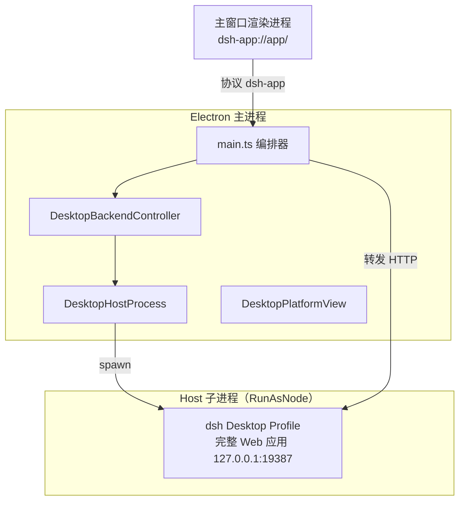
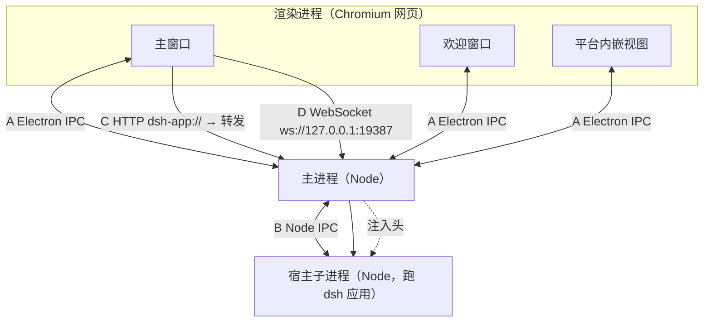
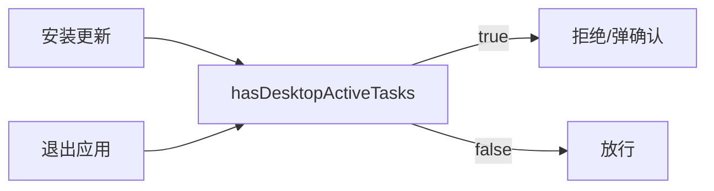

# desktop 学习笔记

状态：草稿（2026-09-27 通读 `apps/desktop` 与 `apps/desktop-host` 源码；同日补充进程分工动因、ELECTRON_RUN_AS_NODE 本质、主/渲染进程关系、四通道通信）

## 事实源（链接，不复述）

- [apps/desktop/README.md](../../../apps/desktop/README.md) — 桌面外壳的权威行为描述（进程/窗口/凭证/更新/退出）
- [apps/desktop/src/main.ts](../../../apps/desktop/src/main.ts) — 主进程编排
- [apps/desktop/src/host-process.ts](../../../apps/desktop/src/host-process.ts) — RunAsNode 子进程生命周期 + 双包 IPC 契约
- [apps/desktop/src/backend-controller.ts](../../../apps/desktop/src/backend-controller.ts) — 后端启动/停止状态机
- [apps/desktop/src/web-document.ts](../../../apps/desktop/src/web-document.ts) — 自定义协议 + HTTP 转发
- [apps/desktop/src/ipc.ts](../../../apps/desktop/src/ipc.ts) — 渲染进程产品 API 协议
- [apps/desktop/src/platform-view.ts](../../../apps/desktop/src/platform-view.ts) — 平台内嵌视图 + 凭证隔离
- [apps/desktop/src/platform-ipc.ts](../../../apps/desktop/src/platform-ipc.ts) — 平台桥频道名（含同步 `bootstrap`）
- [apps/desktop/src/preload-platform-account.ts](../../../apps/desktop/src/preload-platform-account.ts) — 平台凭证同步 IPC + 纯内存 getter
- [apps/desktop-host/src/index.ts](../../../apps/desktop-host/src/index.ts) — Host 入口（`runProfile` + IPC 上报）
- [apps/desktop-host/src/update-tasks.ts](../../../apps/desktop-host/src/update-tasks.ts) — 更新安装准入
- [apps/desktop-host/src/quit-inspection.ts](../../../apps/desktop-host/src/quit-inspection.ts) — 退出时任务检查
- [apps/desktop-host/src/platform-session.ts](../../../apps/desktop-host/src/platform-session.ts) — 账户凭证私有发布
- [docs/subsystems/web-server.zh.md](../../../docs/subsystems/web-server.zh.md) 与 [docs/subsystems/client-modules.zh.md](../../../docs/subsystems/client-modules.zh.md) — 被 desktop 复用的 Web 双半

## 它是什么（用自己的话）

Desktop 是 L4 接口层的一员（与 Web GUI 并列），但它不是「重新实现一个桌面客户端」，而是「把完整的 dsh Web 应用装进一个 Electron 外壳」。外壳 `apps/desktop` 负责 Electron 原生能力（窗口/托盘/协议/更新/凭证），宿主 `apps/desktop-host` 在 Electron 的 Node 模式下跑起完整 dsh 应用，二者通过私有 Node IPC 通信。外壳渲染进程从不直连宿主：一切 HTTP 经主进程转发，认证 cookie 由主进程独占。

## 进程模型：三类进程，三个独立的 OS 进程

Desktop 不是「一个进程」，而是**三类互相独立的操作系统进程**，外加若干视图。理解的关键是：**渲染进程不是主进程的一部分**——主进程和渲染进程是平级的独立进程，就像「浏览器本体」与「浏览器里的标签页」。

三类进程的本质对比：

| 进程 | 本质 | 跑什么 | 能碰什么 |
|---|---|---|---|
| Electron 主进程 | 一个 Node 进程 | `main.ts` | Node + Electron API + 操作系统 |
| 渲染进程（×N） | Chromium 渲染器进程 | 网页（HTML/CSS/JS） | 只有 DOM/JS，关在沙箱里 |
| Host 子进程 | 另一个 Node 进程（Electron 二进制纯 Node 模式） | 完整 dsh Web 应用 | 完整 Node + `--expose-internals` |

最贴切的类比：**渲染进程就是「网页」，主进程就是「跑这个网页的外壳程序」**——就像你在浏览器里打开标签页，标签页（渲染进程）和浏览器本体（类比主进程）是不同的进程，标签页崩了浏览器本体还在。



完整的进程/视图分工：

| 进程/视图 | 由谁创建 | 干什么 | 能碰什么 |
|---|---|---|---|
| ① Electron 主进程 | Electron 框架 | 窗口、菜单、托盘、协议、更新、崩溃恢复、**持有凭证** | Node 文件系统 + OS API + 凭证 |
| ② 主窗口渲染进程 | 主进程 `createMainWindow` | 展示 dsh Web 前端 UI | 只碰 DOM/JS，`sandbox`+`contextIsolation` |
| ③ 欢迎窗口渲染进程 | 主进程 | 登录 / 填 API Key 的引导页 | 同②，唯一用 React 的端 |
| ④ 平台内嵌视图 | 主进程 `platform-view.ts` | 账户余额/用量/充值页（内嵌第三方平台文档） | 独立 storage partition，凭证经同步 IPC 只读 |
| ⑤ Host 子进程 | 主进程 `spawn` | 跑完整 dsh 应用：Web 服务器 + agent loop + 插件 | 完整 Node + `--expose-internals` |

关键区分：①②③④ 是「外壳」，⑤ 是「应用」。外壳里的渲染进程（②③④）**从来不直连 ⑤**，一切都经 ① 转发。

**关键认知**：`desktop-host` 是「宿主」不是「后端」。它跑的是**整个** dsh Web 应用（`runProfile({ profile: 'desktop' })` + 固定端口 `19387`），外壳只做转发与原生集成。这一条是理解整个 desktop 的钥匙——见下方「易混淆点」。

### 渲染进程是独立的 OS 进程

主窗口、欢迎窗口、平台内嵌视图，每个都是一个独立的 Chromium 渲染器进程，**不是主进程的一部分**。证据在 `main.ts`：`render-process-gone` 事件能被主进程捕获并报错——如果渲染进程是主进程的一部分，它崩了主进程也就崩了，根本不可能「捕获并报错」。

渲染进程被关在沙箱里（`nodeIntegration: false` + `contextIsolation: true` + `sandbox: true`），因为网页内容**不可信**（可能加载第三方脚本、可能有漏洞）。它碰不到 Node/OS，只能通过 preload 暴露的有限 API 与主进程对话——这样即便渲染进程被攻破，也拿不到文件系统、拿不到凭证。

**为什么要把主进程和渲染进程分成两个进程**，三个理由：

1. **安全（最主要）**：渲染进程跑网页内容，网页不可信、可能被攻破。关进沙箱后即便被攻破，攻击者也拿不到文件系统、拿不到凭证。

2. **稳定**：一个页面崩溃（渲染进程）不应拖垮整个应用（主进程 + 其他窗口）。Chromium 的多进程架构天生提供这个隔离——每个标签页独立崩溃。

3. **职责单一**：主进程只干「原生外壳」，渲染进程只干「展示 UI」，互不干扰。

> 「主进程」的 `main` 不是「主从关系」的「主」，而是「入口脚本」——来自 `package.json` 的 `"main": "lib/main.js"`，指「Electron 启动时第一个跑的那个 Node 脚本」。

## 为什么「外壳 / 宿主」要二分

把 dsh 应用作为独立子进程跑，而不是塞进主进程，有四个动机：

1. **两个生命周期解耦**：dsh 应用有自己的「启动 → 运行 → 优雅关闭 → 崩溃 → 重启」，Electron 主进程有自己的「ready → before-quit → will-quit」。合并会强制耦合——任何一方崩溃/退出都会拖累另一方。拆开后主进程可以独立重启 Host（`backend-controller.ts` 状态机）、更新前优雅停掉再拉起新 Host（`main.ts` 的 `restoreHost`）。

2. **崩溃隔离**：agent 循环、插件、模型调用跑在 Host，崩了主进程还能弹窗报错、写崩溃报告、甚至「禁用全部插件后重启」（`fatal-recovery.ts`）。

3. **环境隔离**：dsh 需要完整 Node 能力（甚至 `--expose-internals` 暴露内部模块），主进程有自己的受限环境，混在一起互相污染。

4. **复用而非重写**：dsh 是跨入口产品（CLI/Web/ACP/Desktop 跑同一个 dsh）。Desktop 没有重写 dsh，而是复用 `runProfile`。「宿主 = 跑 dsh 应用」天然就是独立进程，把 Electron 主进程和它合并才是额外工作。这与仓库「loop 可替换、能力外挂」的哲学一脉相承——外壳是薄薄一层，真正的应用独立自足。

## ELECTRON_RUN_AS_NODE=1 的本质

Electron 二进制内部本就内嵌了 Node + V8（Chromium 也用它跑 JS）。`ELECTRON_RUN_AS_NODE=1` 是 Electron 官方支持的环境变量：**让 Electron 二进制跳过 Chromium/GUI 初始化，以纯 Node.js 模式执行脚本**。

用它是因为：打包后的桌面应用**只分发一个 Electron 二进制**，没有额外带独立的 `node.exe`。与其再塞一个 Node 运行时（体积、签名、兼容性都是负担），不如让**同一个二进制演两个角色**：

| 角色 | 模式 | 作用 |
|---|---|---|
| 外壳主进程 | 正常 Electron | 跑 GUI + Chromium |
| 宿主子进程 | `ELECTRON_RUN_AS_NODE=1` | 同一个二进制，跳过 GUI，只跑 Node |

代码链：`main.ts` 的 `runtimeResources()` 取 `node = process.execPath`（Electron 二进制本身）→ `host-process.ts` 用它 `spawn` → `node-environment.ts` 给子进程环境设 `ELECTRON_RUN_AS_NODE: '1'`。`--expose-internals` 是 dsh 运行时自己要求的 Node flag，desktop 只是原样传给宿主。

> 易混淆：`primary-runtime` 里还有第三个独立 Node（给 Office 技能离线用），与「宿主用 Electron 二进制跑」是两回事。

## 关键实体（双包职责）

| 包 | 包名 | 角色 | 源码规模 |
|---|---|---|---|
| `apps/desktop` | `@deepseek-ai/dsh-desktop` | Electron 外壳（宽而厚：集成 + 打包） | 59 个 `.ts` + 2 个 `.tsx`，128 个打包脚本 |
| `apps/desktop-host` | `@deepseek-ai/dsh-desktop-host` | 被托管的 dsh 运行时（窄而精） | 6 个 `.ts` |

外壳内部的模块分组（`apps/desktop/src`）：

| 类别 | 代表文件 | 职责 |
|---|---|---|
| 进程与生命周期 | `main.ts` / `host-process.ts` / `backend-controller.ts` / `host-protocol.ts` | 编排、子进程 spawn/退出升级、启动状态机、协议版本（`=4`） |
| 单例与恢复 | `single-instance.ts` / `fatal-recovery.ts` / `crash-report.ts` | 单实例锁、致命错误恢复、崩溃报告落盘 |
| 协议与网络 | `web-document.ts` / `ipc.ts` / `platform-ipc.ts` | 自定义协议、HTTP 转发、渲染 IPC 校验 |
| 更新子系统 | `update-coordinator.ts` / `update-schedule.ts` / `mandatory-update-*.ts` | 检查/下载/安装/呈现 + 强制更新策略 |
| 平台集成 | `tray.ts` / `keyboard.ts` / `platform-view.ts` | 托盘、快捷键、平台内嵌视图 |
| 项目与运行时 | `project-manager.ts` / `runtime-tree.ts` / `core-package-set.ts` / `release.ts` | profile 管理、运行时完整性、包集合、版本身份 |

宿主的六个源文件，四个是「控制能力」：

| 文件 | 能力 |
|---|---|
| `index.ts` | 入口：`loadProfileDirectory` + `runProfile`，上报 `ready` |
| `office.ts` / `office-engine.ts` | Office 技能组合 + ASAR 内引擎路径解析 |
| `platform-session.ts` | 账户凭证私有发布 |
| `quit-inspection.ts` | 退出时报告活动任务 + 定时提醒 |
| `update-tasks.ts` | 更新安装准入（inspect/lock/unlock） |

## 核心机制

### 四通道通信

Desktop 有四条通信通道，分工逻辑是「**控制走 IPC，数据走 HTTP/WS，凭证只在主进程注入**」：



| 通道 | 双方 | 机制 | 传什么 |
|---|---|---|---|
| A Electron IPC | 主 ↔ 渲染 | `ipcRenderer`/`ipcMain`（Chromium） | UI 控制、目录选择、更新状态 |
| B Node IPC | 主 ↔ 宿主 | `child.send`/`process.send`（Node） | 生命周期控制、账户凭证、URL |
| C HTTP | 渲染 → 主 → 宿主 | `dsh-app://` 协议转发 | 业务数据（页面/API/bundle） |
| D WebSocket | 渲染 ↔ 宿主 | `onBeforeSendHeaders` 注入头 | 实时流（会话事件） |

**两个「IPC」不是一回事**：A 是 Chromium 的进程间通信（`ipcMain`/`ipcRenderer`），B 是 Node `child_process` 的 IPC（`child.send`/`process.send`）。名字都叫 IPC，但底层机制、API、通信双方完全不同，代码层面毫无交集。

#### 通道 A：Electron IPC（主 ↔ 渲染）

渲染进程是「碰不到 Node 的网页」，要调主进程的能力只能走这条通道，三种模式：

1. **`invoke`/`handle`（异步请求-响应，最常用）**：`ipcRenderer.invoke(channel)` → `ipcMain.handle(channel, ...)` 返回 Promise。例：目录选择、boot 注入、查更新状态。
2. **`send`/`on`（单向 fire-and-forget）**：可双向。渲染→主（如 `onboardingActive`），主→渲染（如 `updatesPresentation` 推送给所有窗口）。
3. **`sendSync` + `event.returnValue`（同步）**：只在「页面脚本执行前必须同步拿到」时用——平台内嵌视图用它同步读凭证，之后 `getAuthToken()` 是纯内存 getter、不再 IPC（见 `preload-platform-account.ts`）。

白名单桥：网页 JS 不能直接碰 `ipcRenderer`（`contextIsolation` + `sandbox`），只能调 preload 通过 `contextBridge.exposeInMainWorld` 暴露的有限函数。主进程侧每个 handler 先做来源校验（`assertDesktopSender` / `assertProductSender`）。

网页 JS 触达主进程能力的调用链：

```text
渲染进程（网页 JS）
   │ 只能调 preload 暴露的有限 API
   ▼
preload 脚本（preload-app.ts）  ← 运行在渲染进程里，但能碰 ipcRenderer
   │ contextBridge.exposeInMainWorld 暴露 API
   │ ipcRenderer.invoke('dsh-desktop:xxx')
   ▼
主进程（main.ts）
   ipcMain.handle('dsh-desktop:xxx', ...)  ← 真正干活、能碰 OS 的地方
```

三种模式的代码对照：

```ts
// 模式 1：invoke/handle（异步双向）
// 渲染侧（preload）：ipcRenderer.invoke(DESKTOP_IPC.directoryPick)
// 主进程侧：       ipcMain.handle(DESKTOP_IPC.directoryPick, async (e) => { ... })

// 模式 2：send/on（单向）
// 渲染→主：ipcRenderer.send(DESKTOP_IPC.onboardingActive, active)
//          ipcMain.on(DESKTOP_IPC.onboardingActive, (e, active) => { ... })
// 主→渲染：window.webContents.send(DESKTOP_IPC.updatesPresentation, state)
//          ipcRenderer.on(DESKTOP_IPC.updatesPresentation, (e, state) => { ... })

// 模式 3：sendSync + event.returnValue（同步）
// 渲染侧：const value = ipcRenderer.sendSync(PLATFORM_IPC.bootstrap)
// 主进程：ipcMain.on(PLATFORM_IPC.bootstrap, (e) => { e.returnValue = ... })
```

#### 通道 B：Node IPC（主 ↔ 宿主）

外壳与宿主没有共享类型包，唯一的耦合点是 `host-process.ts` 里手写的消息契约（协议版本 `DESKTOP_HOST_PROTOCOL_VERSION = 4`）。建立方式：spawn 时 `stdio` 第 4 项设 `'ipc'`，之后 `child.send`/`process.send` 互发结构化消息。

| 方向 | 消息 | 语义 |
|---|---|---|
| Host → Shell | `ready` | 上报 Web 应用地址 + boot 注入 |
| Host → Shell | `fatal` | 致命错误（message + 完整诊断） |
| Host → Shell | `platform-session` | 账户凭证（私有，不进渲染） |
| Host → Shell | `shutdown-complete` | 优雅关闭确认 |
| Host → Shell | `update-tasks` / `quit-inspection` | 控制请求的应答（带 `requestId` 关联） |
| Shell → Host | `shutdown` | 请求优雅关闭 |
| Shell → Host | `update-tasks` / `quit-inspection` | 控制请求（inspect/lock/unlock / 查询） |

三个要点：**① requestId 关联应答**（并发控制请求不串台）；**② 超时保守处理**（更新检查 10s、退出检查 2s，超时按「有活动任务」处理）；**③ 消息逐字段校验**（`isDesktopHostEvent` 把 Host 输出当不可信边界防御）。

#### 通道 C：HTTP（渲染 → 主 → 宿主）

渲染进程访问 dsh 应用的**业务数据**不走直连，而是走 `dsh-app://` 自定义协议 → 主进程 `forwardWebRequest` → 宿主。主进程转发时注入它独占的认证 cookie、剥离连接级头（`transfer-encoding` 等）、插件 bundle 强制 `no-store`。

#### 通道 D：WebSocket（渲染 ↔ 宿主，主进程注入头）

实时流（会话事件、agent 输出）直连 `ws://127.0.0.1:19387`，但主进程用 `onBeforeSendHeaders` 在连接建立前注入 origin + cookie。

### 更新与退出的共用任务检查

这是两个包协作里最精妙的一处：**安装更新和退出应用，问的是同一个问题——「现在停掉 Host 会不会打断工作」**。共用判断 `hasDesktopActiveTasks`（运行中的 agent/subagent/等待审批/队列消息/运行或停止中的 job）。差异只在「退出」额外统计已装载会话的定时提醒。



更新路径比退出多一步「锁」：`lock` 先让 Host 对后续 `connection/request` 返回 503，排空已接入的请求，再复查活动任务——因为「刚检查完、任务又进来了」的竞态会打断新任务。

### 凭证隔离：token 只走主进程

账户 token 由 Host 通过私有 IPC 发给主进程（`platform-session.ts`），渲染进程和账户 RPC 都拿不到。平台内嵌视图用独立 storage partition（按 `sha256(origin + userId)` 分桶），打开前清空 cookie/缓存/IndexedDB，重定向到别的 origin 时剥离注入头。这是「最小化凭证暴露面」在 desktop 的落地。

### 首屏不重定向：boot 注入

主窗口立即加载 `dsh-app://app/`，页面通过注入的 `globalThis.__DSH_BOOT_READY__` 等待 Host 就绪，boot 注入到达后**原地**启动客户端，不重新导航——避免二次加载闪烁。

## 与相邻单元的关系（依赖谁 / 被谁依赖）

- **依赖 `dsh-app-boot` 的 profile 启动器**：宿主用 `loadProfileDirectory` / `runProfile` 启动 `desktop` profile，复用 `loadLayeredEnv`。
- **复用 Web 双半**：外壳 `dsh-app://app/` 直接加载 `dsh-web-frontend/dist`，把请求转发给宿主跑的 Web 服务器——desktop 是「Web GUI」这个 L4 成员的另一个外壳，而非新应用。
- **是 L4 接口层成员**：与 CLI / Web GUI / ACP / SDK / BFF 并列，区别在于它把「宿主半 + 浏览器半」都收进 Electron 进程树。
- **自带独立运行时**：不依赖系统 Python/Node/pnpm，自带离线 primary-runtime（`~/.dsh/dsh-runtimes/dsh-primary-runtime`）供 Office 技能使用。

## 易混淆点（通读中识别出的高价值区分）

1. **`desktop-host` 是「宿主」不是「后端」**：Electron 应用常见的 mental model 是 main/renderer 或 main/backend，容易把 host 当成 desktop 的后端 API。实情是 host 把**整个 dsh Web 应用**跑起来，外壳只是转发层 + 原生集成层。证据：`index.ts` 调 `runProfile({ profile: 'desktop', args: ['--no-open', '--port', '19387'] })`，得到的是一个带 `ctx.connection` / `ctx.webServer` 的完整应用。

2. **外壳渲染进程不直连 Host**：HTTP 请求先到主进程的 `dsh-app://` 协议 handler，再由主进程改写头、注入 cookie、转发到 Host；响应还要剥离连接级头（`transfer-encoding` 等）。渲染进程的 cookie jar 拿不到 Host 的认证 cookie——这是「凭证隔离」的 HTTP 层保障。

3. **「桌面外壳的更新」与「dsh 应用本身的更新」是两回事**：`update-*` 系列管的是**桌面安装包**的自动更新（检查/下载/交接给 NSIS），与仓库里 dsh runtime 的版本演进无关。别把 `DesktopUpdateCoordinator` 当成仓库的依赖更新器。

4. **端口 `19387` 是 desktop 专用**：与 Web 版的 `3080` 分离，避免同一机器上 Web 版与 Desktop 版冲突。

5. **两个「IPC」是两套机制**：Electron IPC（`ipcMain`/`ipcRenderer`，Chromium 的进程间通信，主↔渲染）与 Node IPC（`child.send`/`process.send`，Node `child_process` 的 IPC，主↔宿主）名字都叫 IPC，但底层机制、API、通信双方完全不同。

6. **渲染进程是独立的 OS 进程，不是主进程的一部分**：`main` 指的是「入口脚本」（`package.json` 的 `"main"`），不是「主从关系」。每个窗口/视图是一个独立的 Chromium 渲染器进程，主进程「创建」它但二者平级——证据是 `render-process-gone` 事件能被主进程捕获并报错。

## 验证方式

- 开发启动：根目录 `pnpm run dev:desktop`（或 `make dev-desktop`），脚本先准备 `.desktop-build/targets/<target>/runtime/primary-runtime` 再启动 Electron；首次可能需要下载锁定的依赖。
- 启动后可在 DevTools 里观察 `dsh-app://app/` 的加载与 `__DSH_BOOT_READY__` 注入。

## 遗留问题（登记进 questions.zh.md）

- 更新子系统的完整状态机（`update-coordinator.ts` 各 phase 的迁移条件）尚未逐行精读，目前只知道「lock → 排空 → 交接」的骨架。
- primary-runtime 的打包链路（`scripts/` 的 prepare → sign → package → verify）只知其存在，未读实现。
